# Osocio — Form Automation

App de escritorio (Windows, Python + Tkinter + Selenium) para automatizar el llenado y envío de formularios de leads en varios países, generar los Excels de datos de prueba, validar reglas de campos, programar ejecuciones recurrentes, y chequear que los concesionarios (dealers) de un formulario coincidan con un Excel de referencia.

> El historial de cambios detallado de versiones anteriores quedó guardado en `README_HISTORIAL_ANTERIOR.md` (no se perdió, solo se sacó de este archivo para dejar una guía limpia).

## Instalación

1. Python 3.10+ (o el que ya tengas en `venv/`).
2. Activar el entorno virtual:
   ```powershell
   .\venv\Scripts\activate
   ```
3. Instalar dependencias:
   ```powershell
   pip install -r requirements.txt
   ```
4. Colocar los drivers de navegador (`chromedriver.exe`, `geckodriver.exe`, `msedgedriver.exe`) dentro de `drivers/` — la app no los descarga automáticamente, solo usa los locales.

## Cómo correr la app

```powershell
python run.py
```

O usá el ejecutable ya compilado: `dist/OsocioFormAutomation.exe` (o la carpeta portable, ver [Build portable](#build-portable)).

Al abrir, vas a ver la barra superior con el logo, el campo de **Email destinatario** y el checkbox **Enviar mail** (configuración compartida por todas las pestañas), debajo las 5 pestañas de la app, y al fondo de la ventana una **consola de log** (ver más abajo). La app recuerda casi toda tu configuración entre una sesión y otra — no hace falta reconfigurar todo cada vez que la abrís (ver "La app recuerda tu configuración" en la pestaña Envío de Leads).

> **Cómo leer las capturas:** en las imágenes de cada pestaña vas a ver **recuadros rojos numerados** (①, ②, ③…). Cada número se corresponde con el punto del mismo número en el "Paso a paso" que está debajo de la imagen, así ubicás en pantalla exactamente el control del que se habla.

---

## Elementos comunes a toda la ventana

- **Email destinatario / Enviar mail**: si tildás "Enviar mail", al terminar una corrida (Envío de Leads o Programación de Tests) se manda un mail de resumen a esa dirección. Se habilitan además "Adjuntar resultados", "Adjuntar screenshots" y el modo de envío (**1 por país** o **Consolidado**, un solo mail con todo).
- **Minimizar a la bandeja al cerrar** (checkbox dentro de "⚙ Configurar" en Envío de Leads): si está tildado, al apretar la ❌ de la ventana la app no se cierra: se oculta y aparece un ícono en la bandeja del sistema (al lado del reloj de Windows). Doble click en ese ícono reabre la ventana; click derecho muestra "Restaurar" y "Salir". Si **no** está tildado, la ❌ cierra la app directamente (matando cualquier navegador que haya quedado abierto). En cualquiera de los dos casos, **si hay un envío o comparación corriendo**, la ❌ nunca cierra ni manda a la bandeja: solo minimiza la ventana a la barra de tareas, para no cortar un proceso a mitad de camino.

---

## Pestaña: Envío de Leads

Es la pestaña principal: rellena y envía los formularios reales usando los Excels de datos generados.


**Paso a paso:**

1. **Email destinatario** (arriba a la derecha): si querés recibir un resumen por mail, escribí el destinatario y tildá **Enviar mail**. Se habilitan "Adjuntar resultados", "Adjuntar screenshots" y el modo de envío.
2. **⚙ Configurar** (botón destacado a la derecha de las pestañas): abre la configuración avanzada unificada para toda la aplicación. Permite configurar:
   - "Un Excel por dispositivo" o "Un Excel compartido para todos los dispositivos" (con aviso naranja si es compartido).
   - **Ver navegador mientras corre**: determina si el navegador se abre visible u oculto (headless) en segundo plano de manera global (aplica tanto a envíos de leads, programación, como al Comparador de Dealers).
   - **Pausar para login manual antes de llenar el primer formulario**: al activarse, la app abre el navegador en la landing y **frena ahí** con un cartel emergente para que inicies sesión a mano (SSO, MFA, credenciales). Recién cuando apretás 'Aceptar' cierra cookies, saca la captura de la landing, detecta el formulario y arranca el llenado normal; con 'Cancelar' se corta la ejecución. Aplica a envíos manuales, programados y al Comparador de Dealers.
   - **Minimizar a la bandeja al cerrar**: controla la acción de cierre (ocultar en la bandeja del sistema o salir).

   

3. **MERCADOS** y **EXCELS POR DISPOSITIVO**: cada uno se pone en **Secuencial** (uno detrás del otro) o **Paralelo** (todos a la vez), y son independientes entre sí.
   - **MERCADOS** decide cómo se recorren los países: uno por vez (AR → BO → …) o todos juntos.
   - **EXCELS POR DISPOSITIVO** decide, dentro de cada país, cómo se corren los Excels de los dispositivos que tildaste: Chrome → Firefox → Edge uno detrás del otro, o los tres a la vez. El modo Paralelo acá solo aplica a los navegadores locales (Chrome/Firefox/Edge); LambdaTest corre siempre secuencial.
4. **DISPOSITIVOS / NAVEGADORES**: selección múltiple — Chrome, Firefox, Edge, Mac LT, Android LT.
   - **⚡ Enviar en paralelo por URL (una sesión por URL)**: en vez de correr todo el Excel de un dispositivo como una sola sesión de a un lead por vez, abre **una ventana de navegador por cada fila** del Excel, todas al mismo tiempo — mucho más rápido para volúmenes grandes. Solo aplica a los navegadores locales (Chrome/Firefox/Edge); LambdaTest siempre corre como una sola sesión, ignora este modo. El campo **"máx. simultáneas"** (por defecto 6, límite real de 1 a 20) controla cuántas ventanas se abren a la vez para no saturar la PC. Este modo **se desactiva solo** cuando el envío lo dispara la Programación de Tests (ahí siempre corre secuencial, aunque hayas dejado la casilla tildada).
   - **🧩 Formularios T3 2.0 (usa los Excels …_T3)**: tildalo si los formularios de este envío son la versión nueva Adobe AEM — la app busca directamente los Excels con sufijo `_T3.xlsx` en vez de los normales. 
   - Al elegir **Mac LT** o **Android LT** aparece a la derecha el panel **CREDENCIALES LT** con los campos **User** y **Key** (la contraseña se ve enmascarada). Se auto-completa con lo que ya tengas guardado en `lambdatest_credentials.txt`; si lo cambiás y apretás **💾 Guardar**, se sobreescribe ese archivo. Es la única forma de cargar credenciales de LambdaTest desde la app (no hay otra pantalla de configuración para esto).

   

5. **PAÍSES A EJECUTAR**: hacé click en las tarjetas de los mercados que querés correr (AR/BO/BR/CL/CO/EC/PY/PE/UY) — se pueden elegir varios a la vez, cada tarjeta clickeada queda resaltada y el contador de arriba a la derecha suma. Los links **Todos** / **Ninguno** seleccionan o deseleccionan todos de un click. Recién ahí se habilita (se pone verde) el botón **EJECUTAR ENVÍO**; con 0 países elegidos queda gris y sin click.

6. **DATOS POR PAÍS**: una tabla de previsualización y edición rápida del Excel que se va a usar. Elegís el país con las solapas (Argentina, Bolivia, …) y, si ese país tiene más de un Excel (por distintos dispositivos), el combo **"Excel a revisar"** de la derecha te deja elegir cuál mirar. Botones sobre la tabla:
   - **+ Agregar**: agrega una fila vacía al final.
   - **🗑 Eliminar**: borra la(s) fila(s) seleccionada(s).
   - **📋 Clonar**: duplica la(s) fila(s) seleccionada(s).
   - **🔄 Actualizar**: descarta cambios sin guardar y vuelve a leer el Excel del disco.
   - **💾 Guardar**: escribe los cambios de la tabla de vuelta al archivo Excel.
   - **📂 Abrir Excel**: abre el archivo con Excel/la app asociada, por si preferís editarlo ahí directamente.
   - Podés editar cualquier celda con **doble click** encima (aparece un cuadro de texto editable in-line).

   Así se ve la parte de abajo de la pestaña, con la selección de países arriba y la tabla de datos debajo:

   

7. **EJECUTAR ENVÍO**: se habilita apenas elegís al menos un país. Antes de arrancar, la app **valida que exista un Excel con al menos un lead** para cada combinación país + dispositivo elegida; si alguno falta o está vacío, no ejecuta nada y te lo dice con el detalle (ej. *"Colombia · Chrome: … (vacío / sin leads)"*). Si está todo bien, abre el **modal de ejecución** (ver abajo).
8. **Ver Resultados**: abre la carpeta `resultados/` con el Excel de resultados y las capturas de pantalla de esa corrida. Para LambdaTest, la app **no muestra el video dentro de la ventana**: el link al video de la sesión queda como una columna **"Video LT"** dentro del Excel de resultados — abrilo desde ahí y hacé click en el link.

> **Capturas: solo en los navegadores locales.** Chrome, Firefox y Edge guardan las capturas de cada lead (landing, formulario completado, Thank You) en `resultados/`. **Mac LT y Android LT no sacan capturas**: la evidencia es el **video completo de la sesión**, que se ve desde la columna **"Video LT"** del Excel de resultados. Cada captura contra un dispositivo real es lenta y no muestra nada que el video no muestre, así que la casilla "Adjuntar screenshots" no aplica a LambdaTest.

> Antes de ejecutar necesitás tener generado el Excel de datos correspondiente — si falta, andá primero a la pestaña **Generar Excels con Datos**.

### ⚙ IDs Dinámicos (campos no mapeados, sin tocar el JSON)

Arriba a la derecha de la pestaña Envío de Leads está el botón amarillo **⚙ IDs Dinámicos** (se ve en la captura de arriba, debajo de "Configurar"). Abre un popup para dar de alta y administrar campos no mapeados **desde la interfaz**, sin editar `json/ids_dinamicos.json` a mano. La ruedita del mouse scrollea la lista de la solapa activa desde cualquier parte del popup.

**Solapa "Campos detectados"** — los campos nuevos que la automatización encontró en los formularios durante las corridas (los que quedan registrados en `json/nuevos_campos_<país>.json`). Elegís el país y ves cada campo con su label, ID real, tipo y si es requerido:

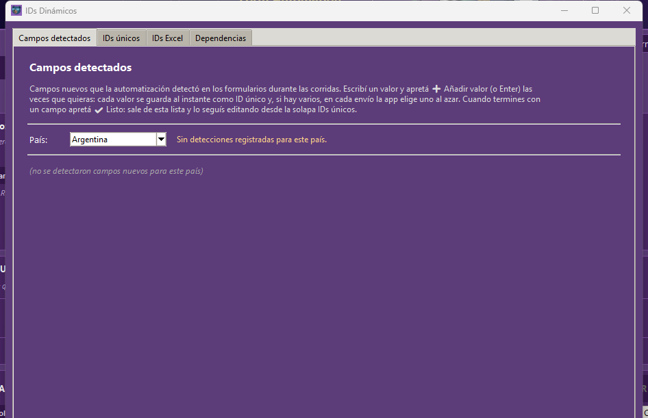

- **Añadir un valor**: escribí en el cuadro y apretá **➕ Añadir valor** (o Enter). Cada valor se **guarda al instante** y queda como una **etiqueta** al lado de "Valores:".
- **Varios valores = rotación aleatoria**: repetí "Añadir valor" las veces que quieras. En cada envío la app **elige uno al azar**, así el campo no se llena siempre igual. Aplica a campos de texto y a dropdowns (elige al azar entre las opciones que coincidan). Si cargás uno solo, usa siempre ese.
- **Quitar un valor**: click en la **✕** de su etiqueta.
- **✔ Listo**: cuando terminás con un campo, lo saca de esta lista para que quede limpia — sus valores no se pierden: quedan en la solapa **IDs únicos**, y de ahí en más lo editás desde allá.

**Solapa "IDs únicos"** — alta manual de cualquier ID no mapeado: escribís el ID, la descripción opcional y los países donde aplica (sin tildar = todos). En **Valor** podés cargar varios: escribí uno y apretá **➕** (o Enter) — queda como etiqueta y se elige uno al azar en cada envío. Abajo se listan los configurados, con **filtro** que busca por ID, descripción, valor o país (podés escribir varias palabras: matchean las filas que contengan todas) más el combo de país, y botones **Editar** / **✕** por fila. Un mismo ID puede tener una fila por país (valores distintos según el mercado); si existieran entradas repetidas del mismo ID **y** mismo alcance de países, la app las fusiona sola en una al abrir el popup, así **Editar siempre te muestra todos los valores juntos**:

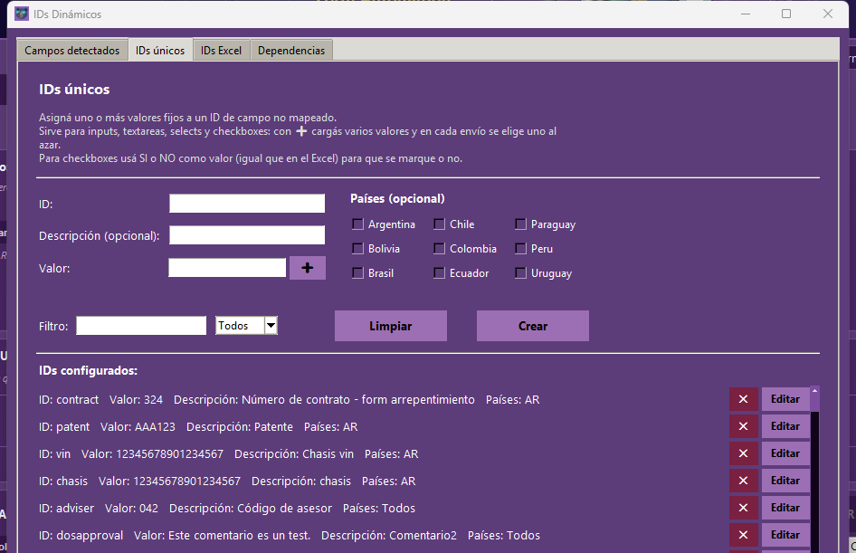

**Checkboxes con SI/NO** — para un checkbox opcional (ej. `test-drive`, newsletter), cargá su ID con valor **SI** o **NO** (los mismos valores que acepta el Excel: si/no, yes/1/0, marcar/desmarcar…). La app lo marca o lo deja sin marcar en cada envío. Si le cargás SI **y** NO como dos valores, sortea entre marcar y no marcar por fila. La columna del Excel, si existe, tiene prioridad sobre esto.

**Solapa "IDs Excel"** — a diferencia de IDs únicos (valores fijos que no vienen del Excel), acá vive el mapeo entre **columnas del Excel de datos** y **campos del formulario real**: le decís a la app "la columna X del Excel va en el campo con id=Y del HTML". Es lo que usa el robot para saber, fila por fila, qué escribir en cada campo al enviar un lead.

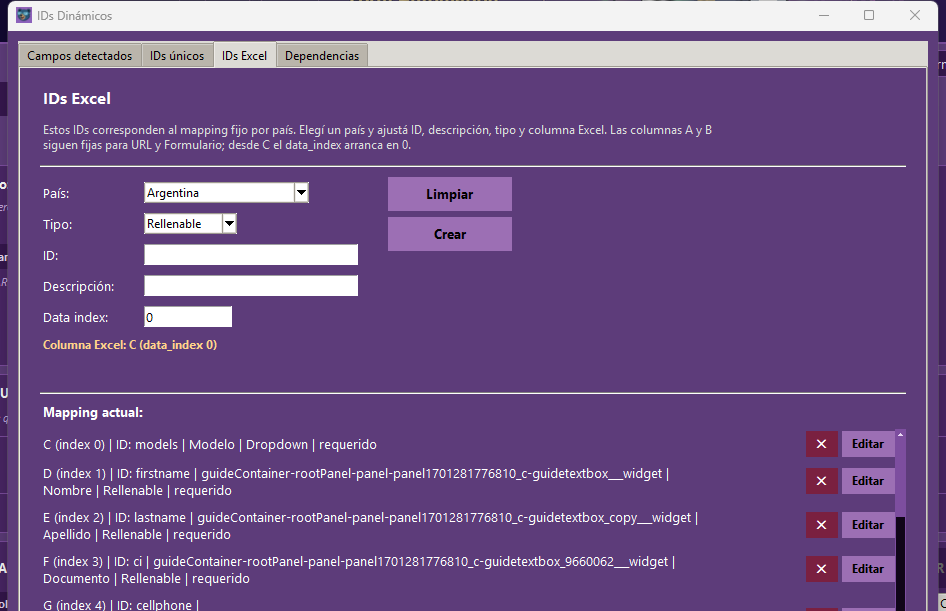

- **País**: para qué país es esta fila del mapping (cada país tiene el suyo).
- **Tipo**: `Rellenable` (input/textarea de texto libre) o `Dropdown` (`<select>`).
- **ID**: el id/name real del campo en el HTML del formulario (ej. `city`, `email`, `dealer`).
- **Descripción**: el nombre de columna que vas a ver en el Excel de datos (pestañas "Generar Excels con Datos" y "Datos por país") — ej. poné `Ciudad` y esa va a ser la columna del Excel.
- **Data index**: la posición del dato, contando desde 0. Las columnas A y B del Excel están siempre reservadas a URL y Formulario; desde la C arranca el dato 0. Por eso `data_index: 0` → columna **C**, `data_index: 7` → columna **J**, etc. — el label amarillo "Columna Excel: …" te lo muestra en vivo apenas escribís el número.
- **Mapping actual**: la lista de abajo, ej. *"J (index 7) | ID: city | Ciudad | Dropdown | requerido"* — se lee: "la columna J del Excel, que se llama Ciudad, va al `<select id="city">` del form, y es un campo obligatorio".

**Ejemplo concreto**: querés que el robot cargue el modelo del auto desde una columna nueva del Excel. En IDs Excel elegís el país, tipo `Dropdown`, ID `model` (el id real del `<select>` en el HTML), descripción `Modelo`, y el próximo `data_index` libre. Guardás, y automáticamente:
1. Se agrega una columna nueva llamada "Modelo" al Excel de datos de ese país (la ves en "Generar Excels con Datos" / "Datos por país").
2. En cada envío, el robot toma lo que haya en esa columna de la fila y lo selecciona en el `<select id="model">` del formulario real.

**Solapa "Dependencias"** — registrá qué ID hijo depende de un ID padre por país, para que la app los llene en orden (ej. `city` depende de `region`: hasta que no se elige la región, el dropdown de ciudad no trae opciones). Elegís el país, el **ID padre** y el **ID hijo**, y quedan listadas abajo para editar o borrar:

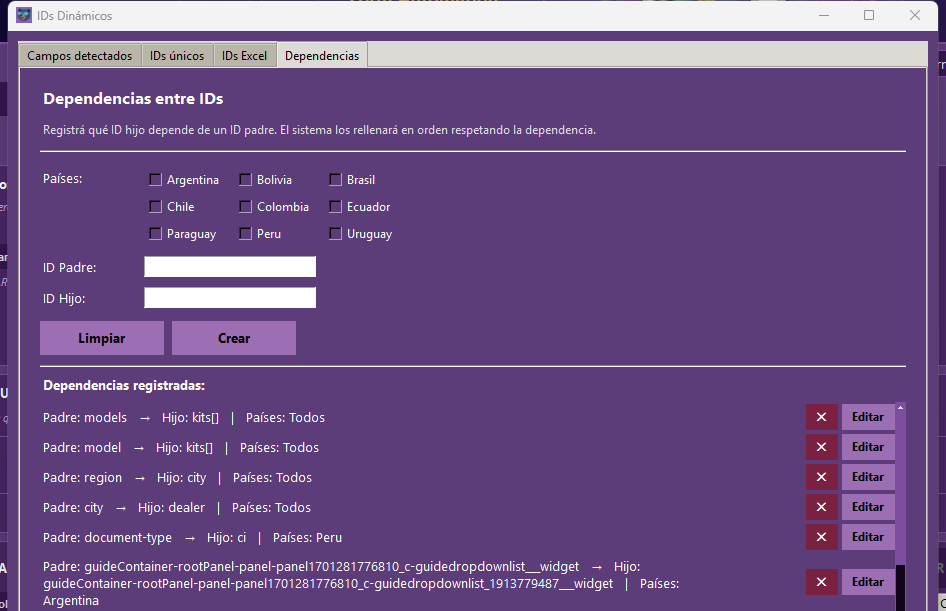

> **Si un campo queda sin valor al enviar, la app te avisa.** Cuando una corrida no puede completar campos porque no tienen valor asignado:
> - **Campos requeridos sin completar** → la fila cuenta como **FAIL** en el Excel de resultados (columna Resultado: *"Campos sin completar (sin valor asignado): …"*) y aparece como error en el mail.
> - **Campos opcionales que quedaron vacíos** → la fila sigue PASS pero la columna Resultado suma el aviso *"campos opcionales vacíos (sin valor asignado): …"*, y el mail incluye la sección **⚠ CAMPOS SIN VALOR ASIGNADO** con línea y campos.
>
> En ambos casos la solución es la misma: abrí **⚙ IDs Dinámicos → Campos detectados** y asignale valor(es) a esos campos.

### Columnas especiales del Excel: marcar o no un checkbox

Por defecto la app **marca todos los checkboxes** que reconoce (términos, privacidad, y cualquier otro que el formulario declare como obligatorio). Si un formulario tiene un checkbox **opcional** y querés decidir vos si se tilda o no, agregá una columna al Excel:

- **El encabezado de la columna** = el atributo `name` del checkbox (o su `id`), tal cual figura en el HTML del formulario.
- **El valor de la celda** = `SI` o `NO`.

Ejemplo: los formularios RAQ de Brasil tienen `<input type="checkbox" name="test-drive">` ("Tenho interesse em realizar um test-drive"). Para que **no** se tilde:

| URL | … | Email | **test-drive** |
|---|---|---|---|
| https://www.chevrolet.com.br/solicitar-contato | … | veronica@mrm.com | **NO** |

Detalles:

- Es **por fila**: podés tener un lead con el test-drive tildado y otro sin él.
- Valores aceptados: `SI` / `NO`, `YES` / `NO`, `TRUE` / `FALSE`, `1` / `0`, `X`.
- Si la columna no corresponde a ningún checkbox del formulario, **se ignora sola** (no rompe nada).
- Un `SI` tilda el checkbox aunque no sea obligatorio; un `NO` lo destilda y evita que la app lo vuelva a marcar antes de enviar.
- No hace falta recompilar el portable: los Excels viven en `data/`, afuera del `.exe`.
- Funciona en **todos los dispositivos**: Chrome, Firefox, Edge, Mac LT y Android LT.

> **Solo aplica a checkboxes.** Para campos de texto o selects el Excel funciona distinto: la columna se mapea al campo por el **nombre del campo** o por el **`id` del HTML**, pero el campo tiene que estar declarado en el `field_mapping` del país (`json/fixed_field_mappings.json`). Si querés que un campo se llene siempre con un valor fijo sin tocar el Excel, usá `json/ids_dinamicos.json` (ver la sección *Qué hay adentro de `json/`*).

### Dropdowns (Modelo, Fecha estimada, Región…): primero el Excel, si no aleatorio

Para los campos `<select>` mapeados (Modelo, Fecha estimada, Región, Ciudad, Concesionario, etc.) la app respeta **siempre primero lo que pusiste en el Excel**:

1. **Si la celda tiene valor** → busca esa opción en el dropdown y la selecciona. El match es por texto: primero exacto, y si no, tolerante ("contiene"), así `Onix` matchea con `Chevrolet Onix`.
2. **Si la celda está vacía** → recién ahí elige una opción al azar (Modelo, Fecha) o la primera válida.

Esto vale para los **tres motores**: navegadores locales (Chrome/Firefox/Edge), LambdaTest y los formularios **AEM / T3 2.0**. Por defecto los Excels generados dejan **Modelo y Fecha estimada vacíos a propósito** (para que roten al azar); si querés fijar uno, escribilo en su columna.

**El modelo elegido queda en el Excel de resultados** (columna Modelo), sea el que pusiste vos o el aleatorio. Y si el formulario **no tiene dropdown de modelo** (el modelo viene fijado en la URL), la app toma el valor de `?model=` de la URL del form y lo escribe igual en esa columna — así siempre sabés con qué modelo se envió el lead.

### El modal de ejecución

Mientras corre el envío, la app abre una ventana "Ejecución de Test" que es tu único tablero de control: te dice qué está pasando y es lo que usás para frenar.


Qué muestra, de arriba abajo:

- **Ejecutando… / N de M mercado(s) completados**: el avance general de la corrida.
- **Detener**: corta todo. Al apretarlo (igual que la ✕ de cerrar) **pide confirmación** antes de frenar. No mata el proceso de golpe: le avisa a las sesiones que frenen, así que puede tardar unos segundos en cerrar los navegadores que estén a mitad de un lead.
- **Las tres pastillas** (*Mercados: Secuencial · Excels: Secuencial · N mercado(s)*): un recordatorio de con qué configuración arrancó **esta** corrida. Sirve para no confundirte si después cambiás los selectores de atrás.
- **Una barra por mercado + dispositivo** (`Bolivia — Chrome`, `Brasil — Chrome`, …): cada una avanza sola. A la derecha ves el estado: mientras corre dice cuántos leads van (`0/1 lead(s) listos`) y al terminar cambia al resultado (`✓ 1 OK · 0 error(es)`). La barra queda **verde** cuando el mercado terminó y **naranja** mientras está en curso.

Mientras el modal está abierto, **la ventana de atrás queda bloqueada** (no podés tocar los selectores ni cambiar de pestaña) para que no le muevas la configuración a una corrida en progreso — por eso el aviso amarillo *"No podés cerrar esta ventana mientras se ejecuta. Para correr otro test ahora, abrí otra ventana de la app."* El botón EJECUTAR ENVÍO de atrás también se deshabilita y pasa a decir **"EN CURSO…"**:


**Cuando termina**, el modal no se cierra solo: se le agregan abajo tres cosas y espera a que las leas.

1. Un **banner de email**: verde con *"✉ Email de resultados encolado a: …"* si tenías "Enviar mail" tildado, rojo si lo tildaste pero **te olvidaste del destinatario** (*"Falta el destinatario: no se envió email"*), o gris si el envío de mail estaba apagado.
2. El **resumen final**: `🟢 N OK` / `🔴 N con error`, sumando todos los mercados.
3. El botón **Cerrar resultados**, que es el que libera la ventana de atrás.

**Qué capturas deja cada lead** (en `resultados/screenshots_<País>_<Navegador><N>/`):

1. `landing_inicial_…` — la landing con el formulario inserto. Si está tildada la pausa para login manual, se toma **después** de que aceptás el cartel (así queda con la sesión ya iniciada).
2. `form_errores_…` — la app aprieta primero **Enviar/Siguiente con el formulario vacío** para forzar las validaciones y captura los mensajes de error. En formularios de varios pasos hay una por paso: `form_errores_paso1`, `form_errores_paso2`, …
3. `form_completado_paso1`, `form_completado_paso2`, … — cada paso ya cargado con los datos del Excel, justo antes de pasar al siguiente (solo en formularios multi-paso).
4. `form_completado_…` — el formulario completo con todos los datos, antes de enviar.
5. `landing_typage_…` — la Thank You page.

Las capturas del formulario recortan **solo el área del form** (en varias partes unidas si es más alto que la pantalla), así que no arrastran toda la landing cuando ésta es kilométrica, y los PNG largos se comprimen para que la carpeta de una corrida pese poco (~1-2 MB por lead).

**Chequeo de la Thank You page (columnas "TYP con CTA" y "LINK ISSUE TYP")**

Después de enviar el lead, la app no se queda solo con la captura de la TY page: revisa los links que hay adentro y deja el resultado en dos columnas del Excel de resultados.

- **TYP con CTA**: busca los `<a>` dentro de la TY (`div#thank-you` / `div.rp-wrapper`). Si no hay ninguno queda en `NO`; si hay, los abre uno por uno y anota, por cada link, el texto, el `href`, el `target`, a qué URL terminó llegando y el nombre de la captura que dejó. Si hay varios, van todos separados por ` || ` (`SÍ (2 links) || …`).
- **LINK ISSUE TYP**: detecta links **rotos por HTML mal escapado** — un `href`/`data-href`/`data-url`/`src` cuyo valor trae adentro un tag literal (`</span`, `&lt;`, etc.), típico de una inyección de contenido mal armada. Si aparece, marca `SÍ` con la descripción, una captura señalando dónde está el link, y adónde llevó al clickearlo. Si no hay nada raro, queda en `-`.

Las capturas de este chequeo se guardan aparte, en `cta_evidence/`. En LambdaTest (Mac/Android) el CTA se reporta igual en el Excel, pero **sin** captura de evidencia.

**La app recuerda tu configuración:** todo lo que elegís en esta pestaña (dispositivos tildados, modo Mercados/Excels, "enviar en paralelo por URL" + su máximo, "T3 2.0", y toda la config de email) se guarda solo, apenas lo cambiás, en `json/config_global.json`. Si cerrás la app y la volvés a abrir, la encontrás tal cual la dejaste — no hace falta volver a tildar todo de nuevo.

---

## Pestaña: Programación de Tests

Programa la ejecución automática y recurrente de "Envío de Leads" (por ejemplo, todos los martes a las 03:00) sin que tengas que apretar nada.


**Paso a paso:**

1. **MERCADOS** y **DISPOSITIVOS / NAVEGADORES**: mismos selectores que en "Envío de Leads". Si elegís LambdaTest acá, aparece un aviso: *"Si corrés en paralelo con LambdaTest, asegurate de que tu plan soporte suficientes sesiones concurrentes."*
2. **⚙ Configurar automatización**: abre el calendario semanal.
   - **Días (Lun a Dom)**: hacé click en un día para abrir su panel de horarios (vuelve a hacer click para cerrarlo). Debajo de cada día ves un estado: `—` (nada programado), `N sel.` (N horarios elegidos), o `● abierto` (el que tenés desplegado ahora).
   - **Horarios del día abierto**: una grilla de botones cada 15 minutos (00:00 a 23:45) — click para tildar/destildar un horario, se pone de color y con relieve "apretado" cuando está activo. Podés elegir tantos horarios como quieras en el mismo día.
   - **Agregar horario personalizado**: un campo `HH:MM` + botón **+ Agregar** (o Enter) para un horario que no caiga justo en el grillado de 15 minutos.
   - **Horarios elegidos**: aparecen como chips "✕ HH:MM" debajo de la grilla — click en el chip para sacar ese horario puntual.
   - **Aplicar a otros días**: con al menos un horario tildado en el día abierto, aparece la fila **"Aplicar estos horarios a otros días"** — botón **Todos** (copia instantánea a los 7 días) o elegir días puntuales y confirmar con **"✓ Aplicar a N días"** (si un día ya tenía horarios, se avisa "(se reemplaza)").

     

   - **Modo "Solo este día" / "Todos los días"**: si activás "Todos los días", cualquier horario que toques en el día abierto se replica en vivo a todos los demás días (aparece un aviso "⚠ Cambios aplican a TODOS los días"). Es distinto de "Aplicar a otros días", que es una copia puntual de una sola vez.

   

   - **PAÍSES A TESTEAR**: tildá los países que se van a correr en cada disparo programado (link **"Seleccionar todos"** para marcarlos todos juntos). Abajo de todo, **Guardar configuración**:

     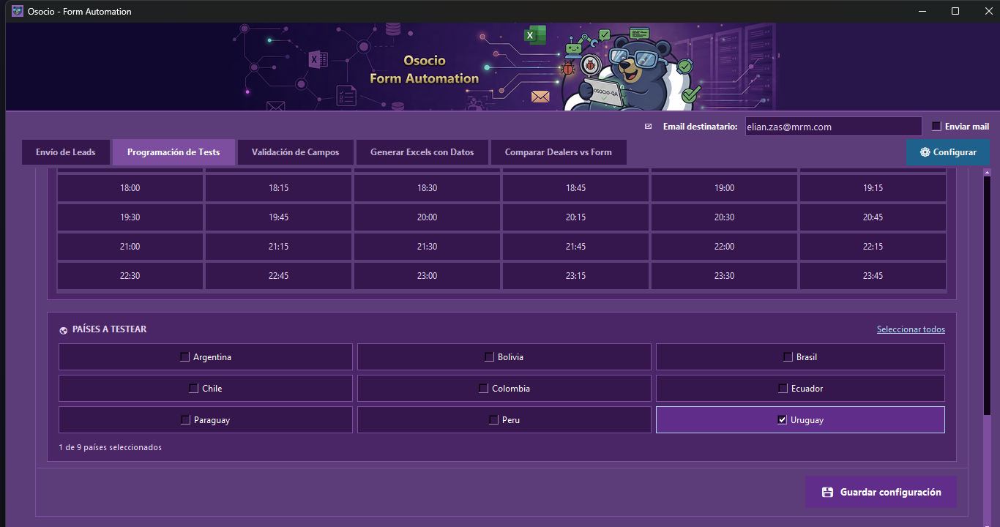
   - **Guardar configuración**: guarda el calendario armado. Antes de guardar, la app valida que ya existan los Excel necesarios en `data/` para cada combinación país + dispositivo elegida (si falta alguno, avisa "Archivos Excel Faltantes").
3. Una vez guardada, en la pestaña principal aparece la tarjeta **"Programado en background"** con un resumen del próximo disparo (día, hora, modo, mercados).
4. **Programar test automático**: activa la programación. El botón cambia a **Iniciar ahora** (para disparar ya, sin esperar el horario) + **Desactivar**.
5. **La app tiene que estar abierta** para que el monitor (revisa cada 5 segundos) detecte el horario y dispare la ejecución — si estaba cerrada, al reabrirla corre el horario pendiente del día.

---

## Pestaña: Validación de Campos

Chequea que las reglas de validación (regex, largo, campo obligatorio, etc.) de cada campo del formulario real coincidan con lo esperado — sin llegar a enviar un lead real.


**Paso a paso:**

1. **Tabla de URLs**: se carga desde un Excel (columnas País / URL / Formulario). Usá **Abrir Excel** para editarlo por fuera, o **Actualizar** para recargarlo después de un cambio. **Ver navegador**: tildalo si querés ver el browser mientras corre la validación.
2. **▶ Configuración de ID**: desplegá esta sección para mapear cada campo del formulario. Al abrirla ves:
   - **ID**: el id real del elemento HTML en el formulario.
   - **Descripción**: nombre legible del campo (ej. "NOMBRE").
   - **Dropdown**: tildalo si el campo es un `<select>` (desactiva los campos de regex, que no aplican).
   - **Inputmode = "numeric"**: marca que el campo muestra teclado numérico en mobile.
   - **Regex full** / **Regex char**: la expresión regular completa del valor válido, y la de caracter-por-caracter (para bloquear teclas inválidas mientras se escribe).
   - **Texto de prueba**: el valor que se va a tipear en ese campo durante la validación, más una fila de checkboxes por país (AR/BO/BR/CH/CO/EC/PA/PE/UY) para que la regla aplique solo a algunos mercados.

   

   - **Filtro** (texto libre) + combo de **País** + **Limpiar filtros**: filtran la tabla de reglas de abajo.
   - **Generador regex**: abre un asistente para armar la expresión regular sin escribirla a mano — tildás combinaciones de **Letras minúsculas, Letras mayúsculas, Acentos, Espacios, Símbolos, Números, Máx. 2 iguales seguidos, No todos iguales, Todos iguales, Al menos una vocal, Al menos una consonante, Email, Campo obligatorio**, y definís **Mín./Máx. largo**. Va mostrando en vivo el "Regex full" y "Regex char" resultantes, con botones **Copiar regex full** / **Copia regex char** para pasarlos al portapapeles y pegarlos en los campos de arriba.

     

   - **Limpiar campos**: vacía el formulario de arriba para cargar una regla nueva desde cero.
   - **Mensaje de error**: abre un popup para definir qué mensaje de error espera ver la app cuando el campo falla. Si el campo es Dropdown, es un único mensaje; si no, podés cargar **varias reglas regex → mensaje** (distintos mensajes según qué regla de formato se rompa) — ojo, primero tenés que tener un ID cargado/seleccionado, si no la app avisa "Completá o seleccioná un ID antes de configurar mensajes." en vez de abrir el popup vacío.

     

   - **Dependencia**: abre un popup para decir que este campo depende del valor de otro (ej. "Ciudad" solo tiene sentido si "Región" ya tiene un valor elegido) — se arma como una lista de pares (ID dependiente, Valor), con botones **Agregar / Editar dependencia** y **Eliminar dependencia**.

     
   - **Agregar regla / Editar regla**: guarda el formulario de arriba como una regla nueva, o actualiza la seleccionada (el botón cambia de nombre solo según si hay una fila elegida en la tabla).
   - **Eliminar regla**: borra la regla seleccionada de la tabla.
   - **Tabla de reglas**: lista todo lo cargado (ID, Dropdown, Descripción, Dependencias, Regex full, Regex char, Texto de prueba, Países, Teclado mobile) — click en una fila para traerla al formulario de edición.

     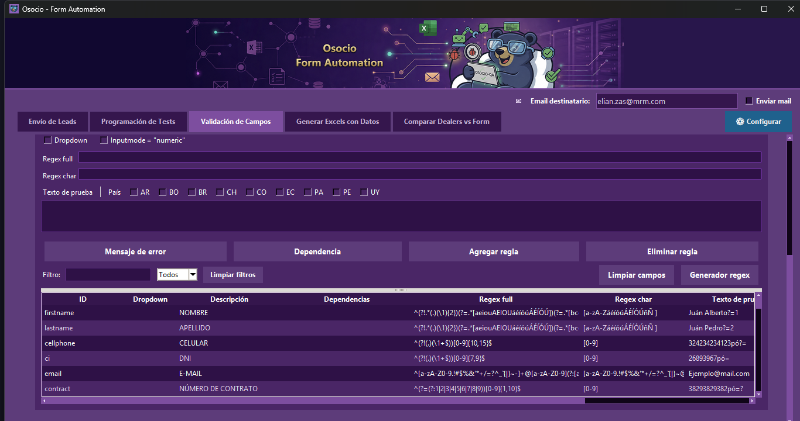
3. **Ejecutar validación**: corre la validación real contra el/los formularios configurados.
4. **Resultados**: abre la carpeta con el detalle de la validación.

---

## Pestaña: Generar Excels con Datos

Genera el Excel de datos de prueba (nombre, documento, teléfono, email, modelo, ciudad, dealer, etc.) que después usan "Envío de Leads" y "Programación de Tests".


**Paso a paso:**

1. **MERCADO A GENERAR**: elegís un país a la vez (se genera un Excel por mercado).
2. **DISPOSITIVOS PARA EL EXCEL**: selección múltiple (Chrome, Firefox, Edge, Mac LT, Android LT) — se genera un Excel por dispositivo elegido. Tildá **"Es formulario T3 2.0"** si el form es la versión nueva Adobe AEM (el archivo se genera con sufijo `_T3.xlsx`).
3. **URLS A PROCESAR**: elegí el formato con las pills — **"URL Landing + URL Form"** (`url landing • url form • ...`) o **"Solo URL Form"** — y pegá las URLs en el cuadro de texto.
4. Botones de la barra inferior:
   - **GENERAR EXCELS**: crea los archivos con datos aleatorios nuevos.
   - **REGENERAR DATOS**: recrea los datos manteniendo las URLs ya cargadas.
   - **Borrar URLs**: limpia el cuadro de texto.
5. Los archivos quedan en `data/`, con el patrón `Lead_information_Formulario_<País>_<Dispositivo>.xlsx` (o `_T3.xlsx`).

La parte de abajo de la pestaña, con el cuadro de URLs y la barra de acciones:

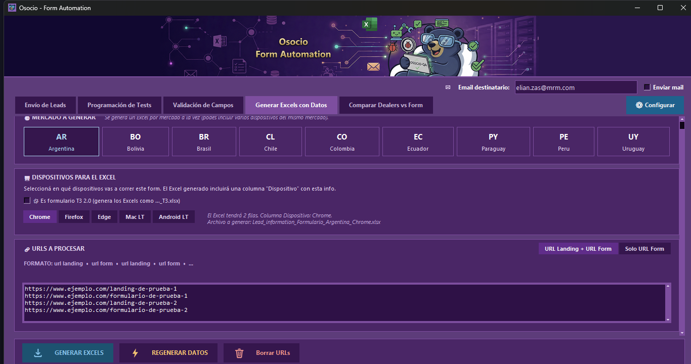

---

## Pestaña: Comparar Dealers vs Form

Chequea que los concesionarios (dealers) de una marca estén correctamente cargados en un formulario real, comparando contra un Excel de dealers esperados — reemplaza el bookmarklet manual que antes se pegaba en la consola del navegador. Todo se valida **en conjunto** (Región → Ciudad → Dealer), nunca un dealer suelto: un mismo nombre en otra provincia no genera falsos positivos.

La pestaña sigue una **mini-guía numerada ①→⑤**, toda arriba de la barra de EJECUTAR. Se ve en dos partes:

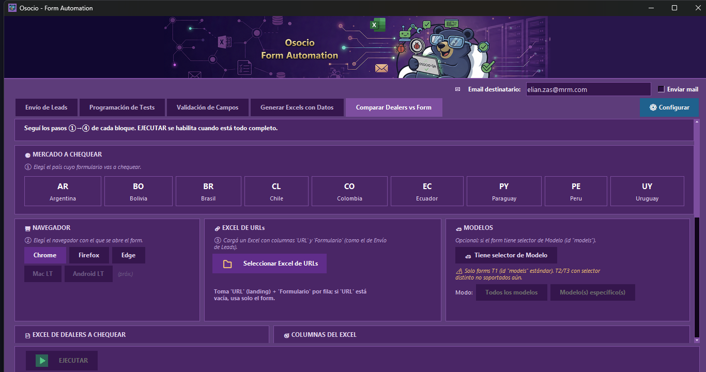

**Paso a paso:**

1. **① MERCADO A CHEQUEAR** — tarjeta del país. Cada país guarda su propia configuración (columnas, Excels, filtro) automáticamente al cambiar de mercado.
2. **② NAVEGADOR** — Chrome / Firefox / Edge. Mac LT / Android LT figuran como *próximamente* (el Comparador solo usa navegadores locales). Que el navegador se vea o no se controla globalmente con **⚙ Configurar**.
3. **③ EXCEL DE URLs** — cargás un Excel (mismo formato que Envío de Leads) con columnas **`URL`** (landing) y **`Formulario`** (form). Por fila: si `URL` tiene valor → abre landing + form; si está vacía → solo form. Solo se toman filas cuyo `Formulario` es una URL real (así, si elegís otro Excel por error, no genera reportes basura). **Cada form del Excel genera su propia carpeta de reporte.**
4. **④ EXCEL DE DEALERS A CHEQUEAR** — **"Seleccionar Excel"** (.xlsx/.xls), **"Fila encabezados"** (número de fila donde arrancan los títulos; el Excel real no siempre arranca en la 1), y el modo del Excel:
   - **Tiene columna de filtro**: definís **Columna filtro** (nombre o letra, ej. `K`), **Valor filtro** (ej. `No`) y la **Condición**:
     - **Incluir** → esos dealers **deben estar** en el form.
     - **Excluir** → esos dealers **NO deben estar** (se verifica la ausencia; si aparecen, es FAIL).
   - **No tiene filtro (usar todas las filas)**: compara todo el Excel contra el form, con la misma lógica de conjunto. Sirve para validar el mapeo Región/Ciudad/Dealer sin depender de una columna de filtro.

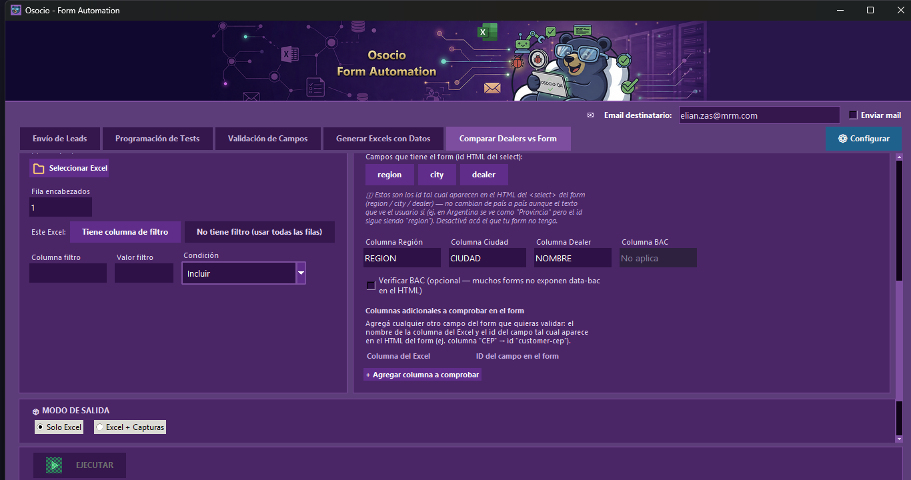

5. **⑤ COLUMNAS DEL EXCEL** — las píldoras **region / city / dealer** son los **ids reales del `<select>` en el HTML** del form (no cambian de país a país, aunque el texto visible sí: "Provincia" en AR sigue siendo `region`). Desmarcá el nivel que tu form no tenga (ej. sin `dealer`, valida solo región+ciudad). Debajo mapeás qué **columna de tu Excel** es cada nivel (Región=`PROVINCIA`, Ciudad=`CIUDAD`, Dealer=`NOMBRE`, etc.).
   - **Verificar BAC**: opcional (muchos forms no exponen `data-bac`).
   - **Columnas adicionales a comprobar**: agregás cualquier campo extra (columna del Excel → id del form, ej. `CEP` → `customer-cep`); quedan como píldoras-checkbox activables. Todo se guarda por país.
6. **Modelos** (opcional) — tildá **"Tiene selector de Modelo"** **solo si la lista de dealers cambia según el modelo** (solo T1 con id `models`). Elegís "Todos los modelos" o "Modelo(s) específico(s)": el comparador repite la revisión de dealers **para cada modelo**. Si los dealers son los mismos sin importar el modelo, **dejalo destildado** — al avanzar el form, si hay un dropdown de modelo, el comparador elige la primera opción válida solo para pasar de paso (si ya viene uno preseleccionado, lo respeta).
7. **📦 MODO DE SALIDA** — **"Solo Excel"** o **"Excel + Capturas"**. Con capturas, quedan como PNG sueltos **junto al Excel dentro de la misma carpeta** del form (sin ZIP; lo comprimís vos si querés).
8. **Envío por email** — no hay configuración de mail dentro de esta pestaña: se controla **solo desde la barra superior de la app** (campo **Email destinatario** + checkbox **Enviar mail**), igual que para el resto de las pestañas. Si al ejecutar el Comparador tenés "Enviar mail" tildado, al terminar **cada form** se manda un mail con su reporte: adjunta la **carpeta completa (Excel + capturas) en un ZIP** si elegiste "Excel + Capturas", o **solo el Excel** si elegiste "Solo Excel". El cuerpo trae el resumen PASS/FAIL/EXTRA/DUPLICADO/OCULTO/NOTA.

   > Antes esta pestaña tenía su propio bloque "✉ ENVIAR RESULTADOS POR EMAIL" abajo de todo. Se quitó porque escribía en la **misma** configuración global que la barra de arriba: eran dos lugares para lo mismo. Ahora el flag de arriba aplica a la pestaña que estés ejecutando.
9. **💾 CONFIGURACIONES GUARDADAS** — guardá el mapeo completo con un nombre y reusalo:
   - **💾 Guardar configuración**: crea una nueva (pregunta antes de sobrescribir si el nombre ya existe).
   - **📂 Cargar**: aplica el preset elegido y copia su nombre al campo Nombre, listo para editar.
   - **✏ Editar**: reescribe el preset seleccionado con los valores actuales; si cambiaste el texto del campo Nombre, lo renombra.
   - **🗑 Eliminar**: borra el preset (con confirmación).
La parte de abajo de la pestaña, con los presets guardados y la barra de EJECUTAR:

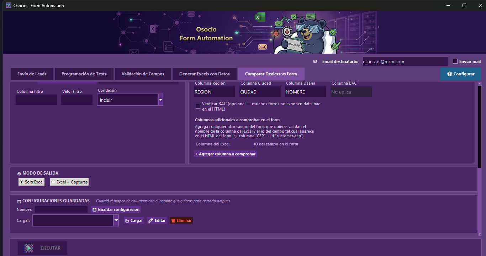

10. **EJECUTAR** — se habilita con el Excel de URLs, el de dealers y las columnas mapeadas. Corre en **2 fases** por cada form: **Fase 1** compara y **guarda el Excel de resultados enseguida**; **Fase 2** (si elegiste capturas) toma las capturas. Cada form deja su **carpeta propia** nombrada `país_form_columna(o sinfiltro)_incluidos|excluidos_timestamp` dentro de `Dealerscheck_resultados/`.

> **Funciona con formularios de 1, 2 o 3 pasos.** Si los dropdowns `region/city/dealer` están en el primer paso, los usa al instante. Si el form es **multi-paso** (los dropdowns aparecen más adelante), el comparador **avanza los pasos** igual que Envío de Leads: completa los campos requeridos de cada paso con valores sintéticos (selects: primera opción válida; textos: dato dummy; checkboxes/radios: los marca) **sin tocar** region/city/dealer, aprieta *Siguiente/Next*, y **recién empieza a comparar cuando aparece el nivel más alto que elegiste** (region si la activaste, si no city, si no dealer). Nunca envía el formulario. Si el form se traba (un campo requerido que no reconoce), lo detecta y corta en vez de quedar en loop.
>
> Importante: activá **solo los niveles que el form realmente tiene**. Si un form tiene `city + dealer` pero no `region`, dejá **region apagado** — si no, cada fila fallará buscando una región inexistente.

**Estados del reporte** (colores en el Excel):

| Estado | Color | Qué significa |
|---|---|---|
| **PASS** | verde | El dealer/combinación está como debe (o correctamente ausente en modo Excluir). |
| **FAIL** | rojo | No está cuando debía (Incluir) o está cuando no debía (Excluir). |
| **EXTRA** | amarillo | Aparece en el form pero **no está declarado en el Excel** (por su combinación región/ciudad). |
| **DUPLICADO** | naranja claro | Aparece **más de una vez** en el mismo dropdown del form. |
| **OCULTO** | naranja | Está en el form pero declarado **solo en filas que no se ven** del Excel (ocultas o filtradas) — todo lo relacionado con filas/columnas no visibles se marca en naranja. |
| **NOTA** | celeste | Mismo dealer, el nombre difiere solo en **detalles menores** (mayúsculas, apóstrofes/comillas, guiones, paréntesis, sufijos tipo `(1000km)`). Cuenta como OK, con el disclaimer en la columna **"Nota Nombre"**. |

> **Nombres con caracteres especiales.** El matching tolera diferencias de puntuación y espaciado: `DANTE D'AMICO S.A. - MATADEROS` matchea con `DANTE D AMICO S.A. – MATADEROS`, y `HCH S.A. - RPM` con `HCH S.A. (RPM)`. Cuentan como PASS con **NOTA**. Lo que **sí** da error es contenido de más o de menos (ej. "Pepito" vs "Pepito Hernández").

> **Filas que no se ven: ocultas vs filtradas.** El Excel a veces viene con filas que no se ven. La app distingue las dos causas y lo aclara en el reporte:
> - **🔎 Filtradas** — escondidas por un **AutoFilter activo** (guardaste el Excel con un filtro aplicado); reaparecen si sacás el filtro.
> - **🙈 Ocultas** — escondidas **a mano** (fila oculta manualmente), sin filtro de por medio.
>
> En la hoja **Resumen** del reporte van en secciones separadas con sus números de fila, y en modo Excluir cada fila afectada dice si está *FILTRADA (AutoFilter)* u *OCULTA (a mano)*. (Los filtros de Excel esconden filas, no columnas; por eso las columnas que no se ven siempre son "ocultas".)

**Evidencia de exclusión (modo Excluir + capturas).** Para probar que un dealer NO está, la app **despliega el dropdown correspondiente dentro del form** (convierte el `<select>` en lista abierta, ya que el popup nativo no es fotografiable) y saca la captura. Se abre el **primer nivel de la cadena que falta**: si la región no está → dropdown de Regiones; si la región está pero la ciudad no → dropdown de Ciudades; si ambas están y el dealer no → dropdown de Dealers. Si el dealer está cuando no debía, aparece **resaltado en amarillo**. Cada captura lleva arriba un banner conciso: URL landing, URL form, **Revisado:** Región · Ciudad · Dealer, y **Estado:** PASS/FAIL con el motivo.

### El modal del Comparador

La comparación corre dentro de un modal que bloquea la ventana de atrás:

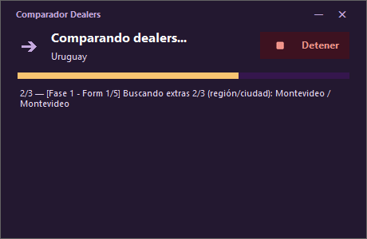

- **Comparando dealers… / país**: sobre qué mercado corre.
- **Barra de progreso** sobre el total.
- **Línea de estado**: la combinación exacta en curso → `Región: CABA · Ciudad: MATADEROS · Dealer: DANTE D'AMICO S.A.` (los niveles activos, form por form).
- **Resumen final**: PASS/FAIL bien grande, más EXTRA/DUPLICADO/OCULTO/NOTA si los hay, el total chequeado y un veredicto (`✓ Todo OK` o `⚠ N con problemas`).
- **Detener**: pide **confirmación** antes de cortar (igual que la ✕ de cerrar). Como el Excel se guarda al terminar la Fase 1 de cada form, si frenás en la Fase 2 (capturas) el reporte igual queda.

Mientras corre, la ventana de atrás queda bloqueada (igual que en Envío de Leads):

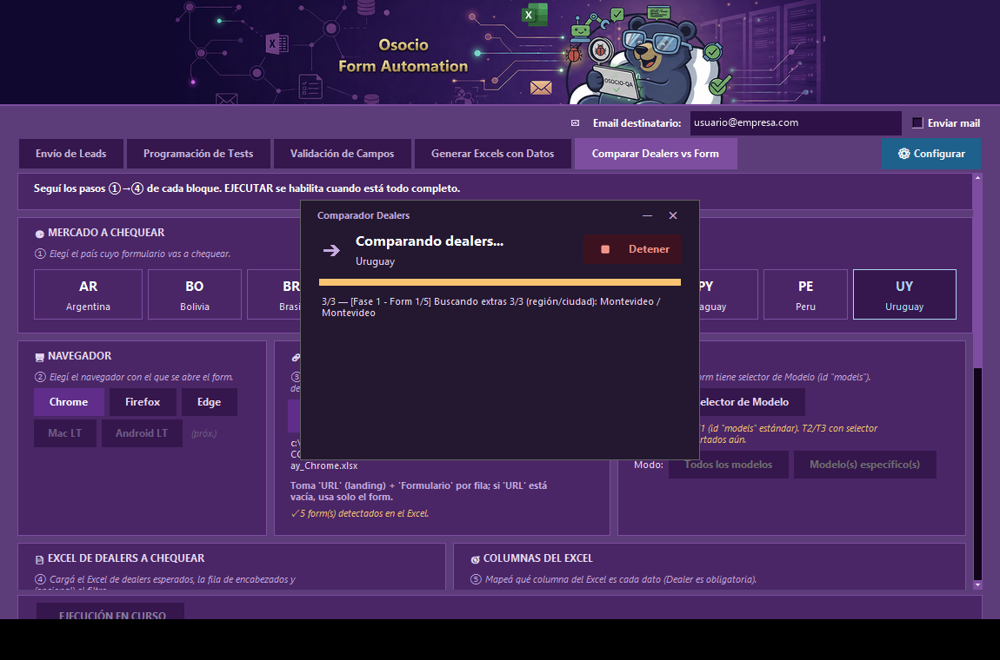

---

## Estructura de carpetas

- `core/`: lógica base de automatización y formularios por país, incluido `dealer_comparator_runner.py`.
- `forms/`: scripts de entrada para ejecutar los formularios de cada país.
- `interface/`: UI de administración (una pestaña por archivo) y utilidades de soporte.
- `lambdatest_mac/` y `lambdatest_android/`: runners y controllers específicos para correr los formularios sobre LambdaTest (Mac y Android).
- `data/`: archivos Excel de entrada (datos de prueba por país/dispositivo). **No se versionan**: los generás vos desde la pestaña "Generar Excels con Datos".
- `drivers/`: drivers locales del navegador (`chromedriver.exe`, `geckodriver.exe`, `msedgedriver.exe`).
- `resultados/`: resultados y capturas de "Envío de Leads" / LambdaTest.
- `cta_evidence/`: capturas del chequeo de CTA / links rotos de la Thank You page.
- `Dealerscheck_resultados/`: reportes y capturas del Comparador Dealers.
- `json/`: configuración persistente (email, programación, reglas de validación, presets del Comparador Dealers).
- `utils/`: generación de datos de prueba, llenado AEM (T3), chequeo de CTA, programación y rutas.
- `validation/`: motor de la pestaña Validación de Campos (regex, mensajes de error, export).

## Qué hay adentro de `json/` (no la borres)

Es la memoria de la app: sin esta carpeta, la app abre pero **no sabe cómo llenar los formularios**. Se divide en dos grupos.

**1. Conocimiento de los formularios — la app no funciona sin esto.** Viaja dentro del portable y del ZIP, y es lo que hace que el `.exe` sirva apenas lo abrís:

| Archivo | Para qué sirve |
|---|---|
| `field_validation_rules.json` + `field_validation_rules_<país>.json` | Las reglas de la pestaña **Validación de Campos** (regex, largos, mensajes de error esperados, dependencias). Una por país, más la general. |
| `ids_dinamicos.json` | Campos que hay que llenar con un valor fijo tuyo y no con un dato aleatorio (ej. "Número de contrato" = `324` en Argentina). Admite varios valores por campo (rota al azar). Se administra desde el botón **⚙ IDs Dinámicos** de Envío de Leads — no hace falta editarlo a mano. |
| `fixed_field_mappings.json` | Mapeos fijos de campo → valor, para formularios que necesitan siempre lo mismo. |
| `nuevos_campos_<país>.json` | Campos extra que aparecieron en el form de ese país y no estaban en la configuración base. Se ven en la solapa **Campos detectados** de ⚙ IDs Dinámicos, donde les podés asignar valor. |

**2. Tu configuración personal — se regenera sola.** Si borrás alguno, la app lo vuelve a crear vacío la próxima vez. **Ninguno de estos entra en el portable**, a propósito (así el ZIP que le pasás a otro no se lleva tu email, tu access key ni tus horarios):

| Archivo | Qué guarda |
|---|---|
| `config_global.json` | Email destinatario, **access key de LambdaTest**, dispositivos tildados, y todas tus preferencias de la UI. **Está en `.gitignore`: nunca se sube ni se distribuye.** |
| `programacion_test.json` | El calendario semanal de la pestaña Programación de Tests. |
| `scheduler_triggered.json` | Marca qué horarios ya se dispararon hoy (para no repetir una corrida). |
| `dealer_comparator_settings.json` | Los presets guardados del Comparador de Dealers, por país. |
| `ejecutor_autonomo.log` | Log del modo autónomo (`python run.py --autonomous`). Basura regenerable. |

## Drivers locales (sin descargas automáticas)

La app usa exclusivamente drivers locales desde `drivers/` (junto al proyecto, o junto al `.exe` al compilar). Si el navegador se actualiza y el driver queda desfasado, reemplazá el `.exe` correspondiente ahí adentro.

## Build portable

```powershell
.\build.bat
```

Genera **solo la carpeta portable**:

- `dist/OsocioFormAutomation_portable/` — con el `.exe` adentro más `data/`, `drivers/`, `json/`, `resultados/`, `temporales/`, `Dealerscheck_resultados/`, `resultados_lambdatestmac/` y `resultados_lambdatest_android/`. Se abre con `Abrir_Osocio_Form_Automation.bat`.

> El build **ya no deja** el `.exe` suelto en `dist/` ni arma el `.zip`: son pasos que sumaban tiempo y el portable ya trae todo. Si necesitás mandarle la app a alguien, comprimí vos la carpeta `dist/OsocioFormAutomation_portable/`.

> **Ojo:** el `.exe` del portable se compila desde el código fuente **en el momento del build**. Si cambiás código, tenés que volver a correr `build.bat` para que el portable lo tome — abrir el `.exe` viejo sigue ejecutando la versión anterior. Para probar cambios al toque, corré `python run.py` desde la carpeta del proyecto.

`lambdatest_mac/` y `lambdatest_android/` van empaquetados **dentro** del `.exe` (vía PyInstaller), no como carpetas sueltas al lado — no hace falta copiarlos a mano.

El portable arranca siempre limpio: sin schedule activo, sin configuración personal del Comparador Dealers, y sin `config_global.json` (evita llevarse el email o la access key de LambdaTest de la PC donde se compiló). Los drivers deben seguir distribuyéndose manualmente dentro de `drivers/`.

## Seguridad — credenciales

- `lambdatest_credentials.txt` y `json/config_global.json` (contiene el email y la access key de LambdaTest) están en `.gitignore` — nunca se suben al repositorio.
- El build portable tampoco los incluye (ver arriba).
- Si necesitás correr LambdaTest, creá `lambdatest_credentials.txt` en la raíz del proyecto con:
  ```
  username=TU_USUARIO
  access_key=TU_ACCESS_KEY
  ```
  o cargalas directo desde la app (panel **CREDENCIALES LT** en la pestaña Envío de Leads, ver arriba).
