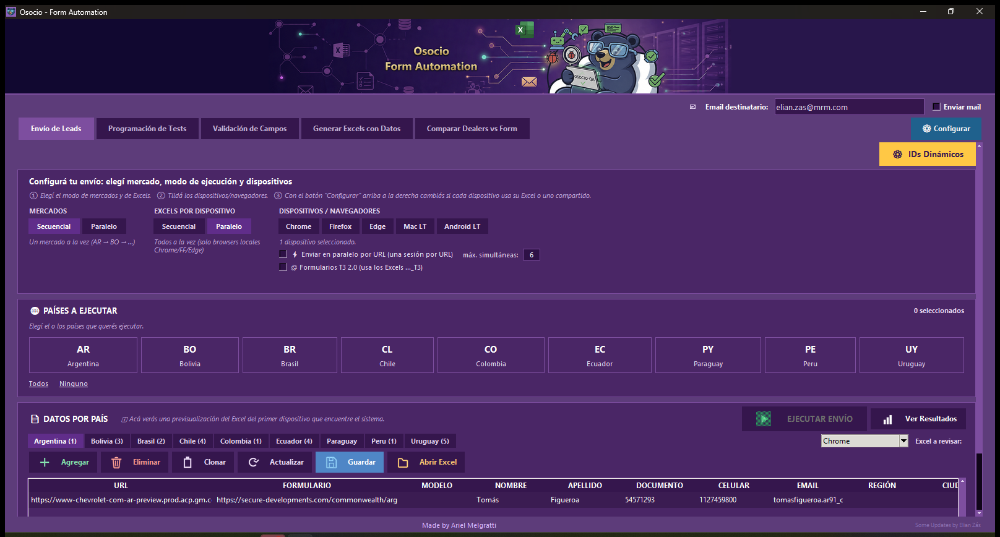
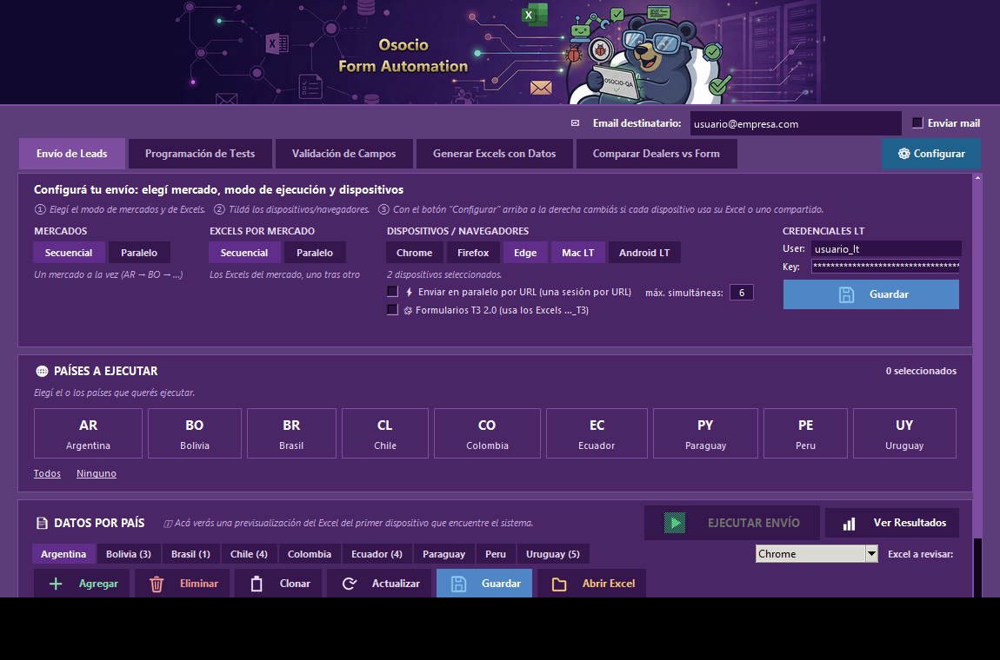
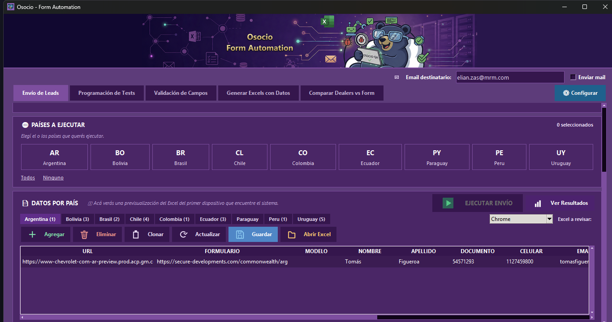
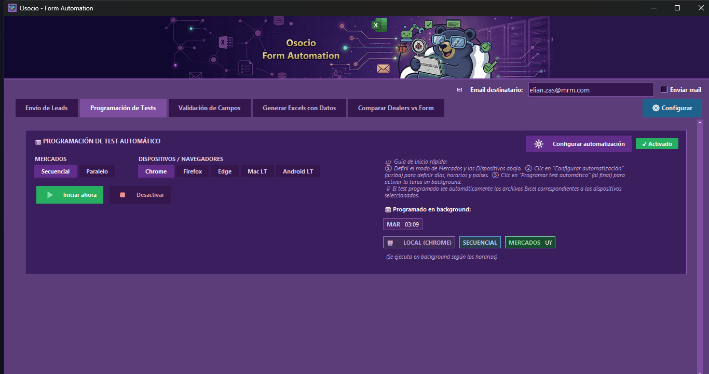
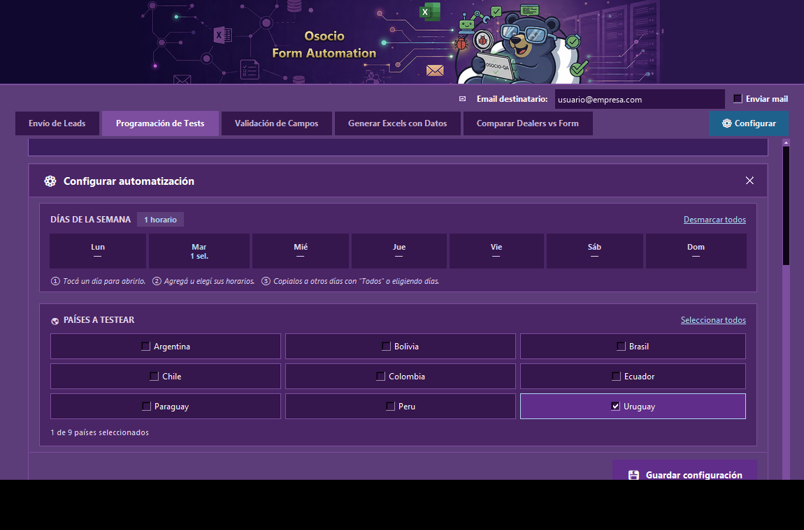
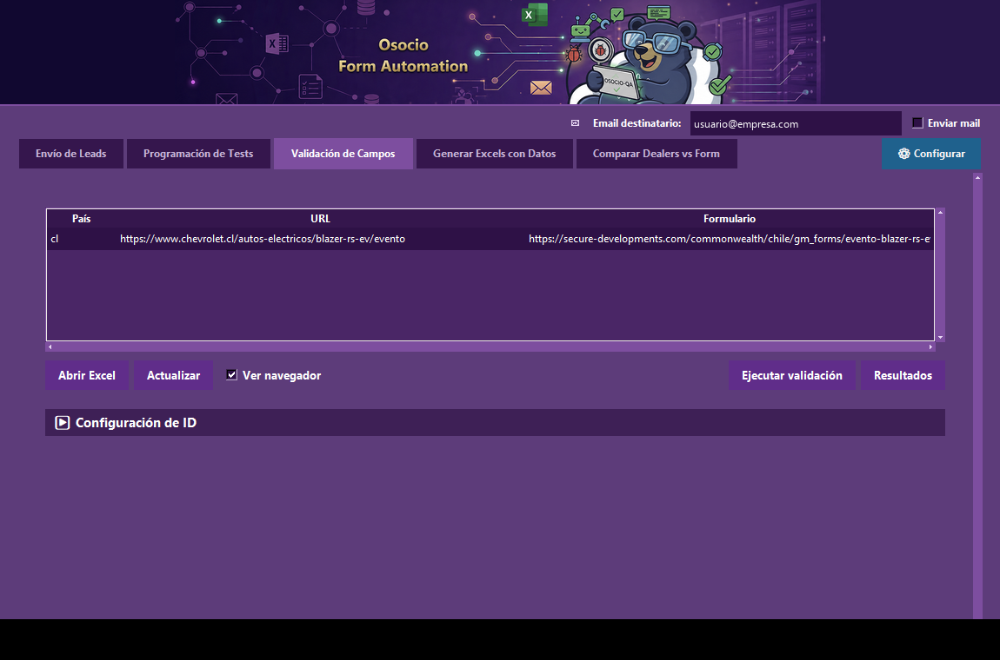
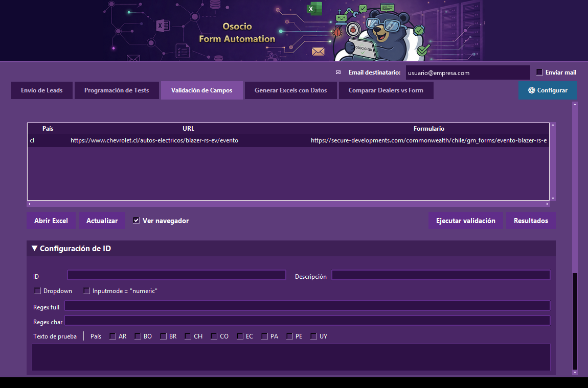
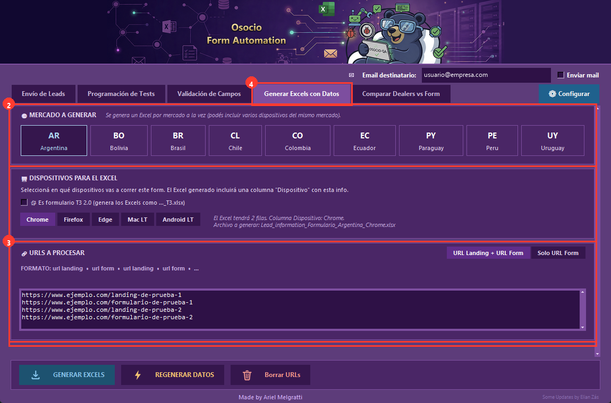

# Osocio — Form Automation

App de escritorio (Windows, Python + Tkinter + Selenium) para automatizar el llenado y envío de formularios de leads en varios países, generar los Excels de datos de prueba, validar reglas de campos, programar ejecuciones recurrentes, y chequear que los concesionarios (dealers) de un formulario coincidan con un Excel de referencia.

> El historial de cambios detallado de versiones anteriores quedó guardado en `README_HISTORIAL_ANTERIOR.md` (no se perdió, solo se sacó de este archivo para dejar una guía limpia).

## Instalación

1. Python 3.10+ (o el que ya tengas en `venv/`).
2. Activar el entorno virtual:
   ```powershell
   .\venv\Scripts\activate
   ```
3. Instalar dependencias:
   ```powershell
   pip install -r requirements.txt
   ```
4. Colocar los drivers de navegador (`chromedriver.exe`, `geckodriver.exe`, `msedgedriver.exe`) dentro de `drivers/` — la app no los descarga automáticamente, solo usa los locales.

## Cómo correr la app

```powershell
python run.py
```

O usá el ejecutable ya compilado: `dist/OsocioFormAutomation.exe` (o la carpeta portable, ver [Build portable](#build-portable)).

Al abrir, vas a ver la barra superior con el logo, el campo de **Email destinatario** y el checkbox **Enviar mail** (configuración compartida por todas las pestañas), debajo las 5 pestañas de la app, y al fondo de la ventana una **consola de log** (ver más abajo). La app recuerda casi toda tu configuración entre una sesión y otra — no hace falta reconfigurar todo cada vez que la abrís (ver "La app recuerda tu configuración" en la pestaña Envío de Leads).

---

## Elementos comunes a toda la ventana

- **Email destinatario / Enviar mail**: si tildás "Enviar mail", al terminar una corrida (Envío de Leads o Programación de Tests) se manda un mail de resumen a esa dirección. Se habilitan además "Adjuntar resultados", "Adjuntar screenshots" y el modo de envío (**1 por país** o **Consolidado**, un solo mail con todo).
- **Minimizar a la bandeja al cerrar** (checkbox dentro de "⚙ Configurar" en Envío de Leads): si está tildado, al apretar la ❌ de la ventana la app no se cierra: se oculta y aparece un ícono en la bandeja del sistema (al lado del reloj de Windows). Doble click en ese ícono reabre la ventana; click derecho muestra "Restaurar" y "Salir". Si **no** está tildado, la ❌ cierra la app directamente (matando cualquier navegador que haya quedado abierto). En cualquiera de los dos casos, **si hay un envío o comparación corriendo**, la ❌ nunca cierra ni manda a la bandeja: solo minimiza la ventana a la barra de tareas, para no cortar un proceso a mitad de camino.

---

## Pestaña: Envío de Leads

Es la pestaña principal: rellena y envía los formularios reales usando los Excels de datos generados.



**Paso a paso:**

1. **Email destinatario** (arriba a la derecha): si querés recibir un resumen por mail, escribí el destinatario y tildá **Enviar mail**. Se habilitan "Adjuntar resultados", "Adjuntar screenshots" y el modo de envío (**1 por país** o **Consolidado**).
2. **⚙ Configurar**: abre la configuración avanzada — elegís "Un Excel por dispositivo" o "Un Excel compartido para todos los dispositivos" (ojo: con el modo compartido, **todos** los dispositivos usan los mismos datos, así que aparece un aviso naranja de que los leads pueden salir duplicados o rechazados; cambiá el modo desde acá si te aparece), y tildás "Ver navegador mientras corre" / "Minimizar a la bandeja al cerrar" si los necesitás.
3. **MERCADOS** y **EXCELS POR MERCADO**: Consecutivo (uno detrás del otro) o Paralelo (todos a la vez).
4. **DISPOSITIVOS / NAVEGADORES**: selección múltiple — Chrome, Firefox, Edge, Mac LT, Android LT.
   - **⚡ Enviar en paralelo por URL (una sesión por URL)**: en vez de correr todo el Excel de un dispositivo como una sola sesión de a un lead por vez, abre **una ventana de navegador por cada fila** del Excel, todas al mismo tiempo — mucho más rápido para volúmenes grandes. Solo aplica a los navegadores locales (Chrome/Firefox/Edge); LambdaTest siempre corre como una sola sesión, ignora este modo. El campo **"máx. simultáneas"** (por defecto 6, límite real de 1 a 20) controla cuántas ventanas se abren a la vez para no saturar la PC. Este modo **se desactiva solo** cuando el envío lo dispara la Programación de Tests (ahí siempre corre secuencial, aunque hayas dejado la casilla tildada).
   - **🧩 Formularios T3 2.0 (usa los Excels …_T3)**: tildalo si los formularios de este envío son la versión nueva Adobe AEM — la app busca directamente los Excels con sufijo `_T3.xlsx` en vez de los normales. 
   - Al elegir **Mac LT** o **Android LT** aparece a la derecha el panel **CREDENCIALES LT** con los campos **User** y **Key** (la contraseña se ve enmascarada). Se auto-completa con lo que ya tengas guardado en `lambdatest_credentials.txt`; si lo cambiás y apretás **💾 Guardar**, se sobreescribe ese archivo. Es la única forma de cargar credenciales de LambdaTest desde la app (no hay otra pantalla de configuración para esto).

   

5. **PAÍSES A EJECUTAR**: hacé click en las tarjetas de los mercados que querés correr (AR/BO/BR/CL/CO/EC/PY/PE/UY). El contador te dice cuántos elegiste. Los links **Todos** / **Ninguno** seleccionan o deseleccionan todos de un click.
6. **DATOS POR PAÍS**: una tabla de previsualización y edición rápida del Excel que se va a usar. Elegís el país con las solapas (Argentina, Bolivia, …) y, si ese país tiene más de un Excel (por distintos dispositivos), el combo **"Excel a revisar"** de la derecha te deja elegir cuál mirar. Botones sobre la tabla:
   - **+ Agregar**: agrega una fila vacía al final.
   - **🗑 Eliminar**: borra la(s) fila(s) seleccionada(s).
   - **📋 Clonar**: duplica la(s) fila(s) seleccionada(s).
   - **🔄 Actualizar**: descarta cambios sin guardar y vuelve a leer el Excel del disco.
   - **💾 Guardar**: escribe los cambios de la tabla de vuelta al archivo Excel.
   - **📂 Abrir Excel**: abre el archivo con Excel/la app asociada, por si preferís editarlo ahí directamente.
   - Podés editar cualquier celda con **doble click** encima (aparece un cuadro de texto editable in-line).

   

7. **EJECUTAR ENVÍO**: se habilita apenas elegís al menos un país. Abre un modal que bloquea la ventana mientras corre, mostrando el progreso mercado por mercado.
8. **Ver Resultados**: abre la carpeta `resultados/` con el Excel de resultados y las capturas de pantalla de esa corrida. Para LambdaTest, la app **no muestra el video dentro de la ventana**: el link al video de la sesión queda como una columna **"Video LT"** dentro del Excel de resultados — abrilo desde ahí y hacé click en el link.

> Antes de ejecutar necesitás tener generado el Excel de datos correspondiente — si falta, andá primero a la pestaña **Generar Excels con Datos**.

**La app recuerda tu configuración:** todo lo que elegís en esta pestaña (dispositivos tildados, modo Mercados/Excels, "enviar en paralelo por URL" + su máximo, "T3 2.0", y toda la config de email) se guarda solo, apenas lo cambiás, en `json/config_global.json`. Si cerrás la app y la volvés a abrir, la encontrás tal cual la dejaste — no hace falta volver a tildar todo de nuevo.

---

## Pestaña: Programación de Tests

Programa la ejecución automática y recurrente de "Envío de Leads" (por ejemplo, todos los martes a las 03:00) sin que tengas que apretar nada.



**Paso a paso:**

1. **MERCADOS** y **DISPOSITIVOS / NAVEGADORES**: mismos selectores que en "Envío de Leads". Si elegís LambdaTest acá, aparece un aviso: *"Si corrés en paralelo con LambdaTest, asegurate de que tu plan soporte suficientes sesiones concurrentes."*
2. **⚙ Configurar automatización**: abre el calendario semanal.
   - **Días (Lun a Dom)**: hacé click en un día para abrir su panel de horarios (vuelve a hacer click para cerrarlo). Debajo de cada día ves un estado: `—` (nada programado), `N sel.` (N horarios elegidos), o `● abierto` (el que tenés desplegado ahora).
   - **Horarios del día abierto**: una grilla de botones cada 15 minutos (00:00 a 23:45) — click para tildar/destildar un horario, se pone de color y con relieve "apretado" cuando está activo. Podés elegir tantos horarios como quieras en el mismo día.
   - **Agregar horario personalizado**: un campo `HH:MM` + botón **+ Agregar** (o Enter) para un horario que no caiga justo en el grillado de 15 minutos.
   - **Horarios elegidos**: aparecen como chips "✕ HH:MM" debajo de la grilla — click en el chip para sacar ese horario puntual.
   - **Aplicar a otros días**: con al menos un horario tildado en el día abierto, aparece la fila **"Aplicar estos horarios a otros días"** — botón **Todos** (copia instantánea a los 7 días) o elegir días puntuales y confirmar con **"✓ Aplicar a N días"** (si un día ya tenía horarios, se avisa "(se reemplaza)").
   - **Modo "Solo este día" / "Todos los días"**: si activás "Todos los días", cualquier horario que toques en el día abierto se replica en vivo a todos los demás días (aparece un aviso "⚠ Cambios aplican a TODOS los días"). Es distinto de "Aplicar a otros días", que es una copia puntual de una sola vez.

   

   - **PAÍSES A TESTEAR**: tildá los países que se van a correr en cada disparo programado (link **"Seleccionar todos"** para marcarlos todos juntos).
   - **Guardar configuración**: guarda el calendario armado. Antes de guardar, la app valida que ya existan los Excel necesarios en `data/` para cada combinación país + dispositivo elegida (si falta alguno, avisa "Archivos Excel Faltantes").
3. Una vez guardada, en la pestaña principal aparece la tarjeta **"Programado en background"** con un resumen del próximo disparo (día, hora, modo, mercados).
4. **Programar test automático**: activa la programación. El botón cambia a **Iniciar ahora** (para disparar ya, sin esperar el horario) + **Desactivar**.
5. **La app tiene que estar abierta** para que el monitor (revisa cada 60 segundos) detecte el horario y dispare la ejecución — si estaba cerrada, al reabrirla corre el horario pendiente del día.

---

## Pestaña: Validación de Campos

Chequea que las reglas de validación (regex, largo, campo obligatorio, etc.) de cada campo del formulario real coincidan con lo esperado — sin llegar a enviar un lead real.



**Paso a paso:**

1. **Tabla de URLs**: se carga desde un Excel (columnas País / URL / Formulario). Usá **Abrir Excel** para editarlo por fuera, o **Actualizar** para recargarlo después de un cambio. **Ver navegador**: tildalo si querés ver el browser mientras corre la validación.
2. **▶ Configuración de ID**: desplegá esta sección para mapear cada campo del formulario. Al abrirla ves:
   - **ID**: el id real del elemento HTML en el formulario.
   - **Descripción**: nombre legible del campo (ej. "NOMBRE").
   - **Dropdown**: tildalo si el campo es un `<select>` (desactiva los campos de regex, que no aplican).
   - **Inputmode = "numeric"**: marca que el campo muestra teclado numérico en mobile.
   - **Regex full** / **Regex char**: la expresión regular completa del valor válido, y la de caracter-por-caracter (para bloquear teclas inválidas mientras se escribe).
   - **Texto de prueba**: el valor que se va a tipear en ese campo durante la validación, más una fila de checkboxes por país (AR/BO/BR/CH/CO/EC/PA/PE/UY) para que la regla aplique solo a algunos mercados.

   

   - **Filtro** (texto libre) + combo de **País** + **Limpiar filtros**: filtran la tabla de reglas de abajo.
   - **Generador regex**: abre un asistente para armar la expresión regular sin escribirla a mano — tildás combinaciones de **Letras minúsculas, Letras mayúsculas, Acentos, Espacios, Símbolos, Números, Máx. 2 iguales seguidos, No todos iguales, Todos iguales, Al menos una vocal, Al menos una consonante, Email, Campo obligatorio**, y definís **Mín./Máx. largo**. Va mostrando en vivo el "Regex full" y "Regex char" resultantes, con botones para copiarlos al portapapeles.
   - **Limpiar campos**: vacía el formulario de arriba para cargar una regla nueva desde cero.
   - **Mensaje de error**: abre un popup para definir qué mensaje de error espera ver la app cuando el campo falla. Si el campo es Dropdown, es un único mensaje; si no, podés cargar **varias reglas regex → mensaje** (distintos mensajes según qué regla de formato se rompa).
   - **Dependencia**: abre un popup para decir que este campo depende del valor de otro (ej. "Ciudad" solo tiene sentido si "Región" ya tiene un valor elegido) — se arma como una lista de pares (ID dependiente, Valor).
   - **Agregar regla / Editar regla**: guarda el formulario de arriba como una regla nueva, o actualiza la seleccionada (el botón cambia de nombre solo según si hay una fila elegida en la tabla).
   - **Eliminar regla**: borra la regla seleccionada de la tabla.
   - **Tabla de reglas**: lista todo lo cargado (ID, Dropdown, Descripción, Dependencias, Regex full, Regex char, Texto de prueba, Países, Teclado mobile) — click en una fila para traerla al formulario de edición.
3. **Ejecutar validación**: corre la validación real contra el/los formularios configurados.
4. **Resultados**: abre la carpeta con el detalle de la validación.

---

## Pestaña: Generar Excels con Datos

Genera el Excel de datos de prueba (nombre, documento, teléfono, email, modelo, ciudad, dealer, etc.) que después usan "Envío de Leads" y "Programación de Tests".



**Paso a paso:**

1. **MERCADO A GENERAR**: elegís un país a la vez (se genera un Excel por mercado).
2. **DISPOSITIVOS PARA EL EXCEL**: selección múltiple (Chrome, Firefox, Edge, Mac LT, Android LT) — se genera un Excel por dispositivo elegido. Tildá **"Es formulario T3 2.0"** si el form es la versión nueva Adobe AEM (el archivo se genera con sufijo `_T3.xlsx`).
3. **URLS A PROCESAR**: elegí el formato con las pills — **"URL Landing + URL Form"** (`url landing • url form • ...`) o **"Solo URL Form"** — y pegá las URLs en el cuadro de texto.
4. Botones de la barra inferior:
   - **GENERAR EXCELS**: crea los archivos con datos aleatorios nuevos.
   - **REGENERAR DATOS**: recrea los datos manteniendo las URLs ya cargadas.
   - **Borrar URLs**: limpia el cuadro de texto.
5. Los archivos quedan en `data/`, con el patrón `Lead_information_Formulario_<País>_<Dispositivo>.xlsx` (o `_T3.xlsx`).

---

## Pestaña: Comparador Dealers

Chequea que los concesionarios (dealers) de una marca estén correctamente cargados en un formulario real, comparando contra un Excel de dealers esperados — reemplaza el bookmarklet manual que antes se pegaba en la consola del navegador.


**Paso a paso:**

1. **MERCADO A CHEQUEAR**: tarjeta del país. Cada país guarda su propia configuración (columnas, URLs, etc.) automáticamente al cambiar de mercado — no hace falta guardar nada a mano para no perder lo que cargaste en ese país.
2. **URL DEL FORMULARIO A CHEQUEAR**: pegá una o varias URLs en el cuadro de texto:
   - Modo **"URL Landing + URL Form"**: de a 2 líneas por form (`url landing` / `url form`).
   - Modo **"Solo URL Form"**: una URL de form por línea.
   - Si las URLs pegadas parecen ser de un país distinto al mercado seleccionado, aparece un aviso en vivo (se actualiza mientras escribís), como se ve en la captura de arriba.
   - Elegí el navegador (Chrome/Firefox/Edge) y tildá **"Ver navegador mientras corre (si está apagado, corre atrás sin molestar)"** si querés verlo (apagado por defecto).
3. **EXCEL DE DEALERS A CHEQUEAR**: botón **"Seleccionar Excel"** (cualquier .xlsx/.xls), **"Fila encabezados"** (número de fila donde arrancan los títulos de columna — el Excel real no siempre arranca en la fila 1), y el toggle **"Este Excel: Tiene columna de filtro"** / **"No tiene filtro (usar todas las filas)"**. Con filtro activo, definís **Columna filtro**, **Valor filtro**, y la **Condición**: **Incluir**, **Excluir**, o **Buscar extras** (búsqueda de dealers EXTRA/DUPLICADOS).
4. **Columnas del Excel**: pills **region / city / dealer** (son los ids reales del HTML del `<select>` — no cambian de país a país aunque el label visible sí, ej. en Argentina se ve "Provincia" pero el id sigue siendo `region`); `dealer` siempre es obligatorio. Definís qué columna del Excel corresponde a cada uno (**Columna Región / Columna Ciudad / Columna Dealer**), más **Columna BAC** (opcional, con su checkbox "Verificar BAC"). Podés tildar **"buscar dealers EXTRA y DUPLICADOS"** y agregar filas en **"columnas adicionales a comprobar en el form"**: cada fila es un par (columna del Excel + id de cualquier otro campo del HTML, ej. columna "CEP" → id "customer-cep"), con una **×** para borrar la fila y un botón **"+ Agregar columna a comprobar"**.
5. **Modelos** (opcional): tildá **"El form tiene selector de Modelo"** si aplica — **importante: esto solo funciona con formularios T1** (el id estándar `models`); formularios T2/T3 con selector de modelo distinto todavía no están soportados. Elegís **"Todos los modelos"** (corre la comparación contra cada modelo que el form ofrezca) o **"Modelo(s) específico(s)"** (campo de texto separado por comas, ej. "Onix, Tracker, S10").
6. **Modo de salida**: "Solo Excel" o "Excel + Capturas (ZIP)".
7. **Configuraciones guardadas**: guardá el mapeo completo de columnas con el nombre que quieras (ej. "GMUY Livianos") con **💾 Guardar configuración**, elegilo después del combo y **📂 Cargar** para reusarlo sin reconfigurar todo de nuevo, o **🗑 Eliminar** para borrar un preset guardado que ya no uses (no hay opción de renombrar: para eso, guardalo con el nombre nuevo y después borrá el viejo).
8. **EJECUTAR**: valida todo antes de arrancar — si falta algo (Excel, URL de form, etc.) muestra un aviso corto sin llegar a abrir nada. Si está todo bien, abre un modal de progreso que bloquea la ventana principal, con botón **Detener** (mientras detiene, se desactiva y muestra "Deteniendo…"), y al terminar muestra **Cerrar** más el resumen 🟢 PASS / 🔴 FAIL / 🟡 EXTRA. El mismo botón EJECUTAR pasa a decir **DETENER** (en rojo) mientras la comparación está corriendo. Si intentás cerrar la ventana principal con una comparación en curso, la app te pregunta primero si de verdad querés detenerla y salir.
9. Los reportes (Excel con colores por estado, y el ZIP de capturas si corresponde) quedan en la carpeta `Dealerscheck_resultados/`.

---

## Estructura de carpetas

- `core/`: lógica base de automatización y formularios por país, incluido `dealer_comparator_runner.py`.
- `forms/`: scripts de entrada para ejecutar los formularios de cada país.
- `interface/`: UI de administración (una pestaña por archivo) y utilidades de soporte.
- `lambdatest_mac/` y `lambdatest_android/`: runners y controllers específicos para correr los formularios sobre LambdaTest (Mac y Android).
- `data/`: archivos Excel de entrada (datos de prueba por país/dispositivo).
- `drivers/`: drivers locales del navegador (`chromedriver.exe`, `geckodriver.exe`, `msedgedriver.exe`).
- `resultados/`: resultados y capturas de "Envío de Leads" / LambdaTest.
- `Dealerscheck_resultados/`: reportes y capturas del Comparador Dealers.
- `json/`: configuración persistente (email, programación, reglas de validación, presets del Comparador Dealers).

## Drivers locales (sin descargas automáticas)

La app usa exclusivamente drivers locales desde `drivers/` (junto al proyecto, o junto al `.exe` al compilar). Si el navegador se actualiza y el driver queda desfasado, reemplazá el `.exe` correspondiente ahí adentro.

## Build portable

```powershell
.\build.bat
```

Genera:
- `dist/OsocioFormAutomation.exe`
- `dist/OsocioFormAutomation_portable/` (con `data/`, `drivers/`, `json/`, `resultados/`, `temporales/`, `Dealerscheck_resultados/`, `resultados_lambdatestmac/` y `resultados_lambdatest_android/`)
- `dist/OsocioFormAutomation_portable.zip`

`lambdatest_mac/` y `lambdatest_android/` van empaquetados **dentro** del `.exe` (vía PyInstaller), no como carpetas sueltas al lado — no hace falta copiarlos a mano.

El portable arranca siempre limpio: sin schedule activo, sin configuración personal del Comparador Dealers, y sin `config_global.json` (evita llevarse el email o la access key de LambdaTest de la PC donde se compiló). Los drivers deben seguir distribuyéndose manualmente dentro de `drivers/`.

## Seguridad — credenciales

- `lambdatest_credentials.txt` y `json/config_global.json` (contiene el email y la access key de LambdaTest) están en `.gitignore` — nunca se suben al repositorio.
- El build portable tampoco los incluye (ver arriba).
- Si necesitás correr LambdaTest, creá `lambdatest_credentials.txt` en la raíz del proyecto con:
  ```
  username=TU_USUARIO
  access_key=TU_ACCESS_KEY
  ```
  o cargalas directo desde la app (panel **CREDENCIALES LT** en la pestaña Envío de Leads, ver arriba).
