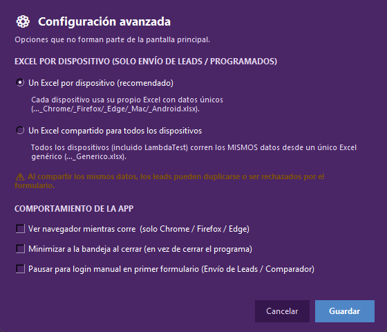
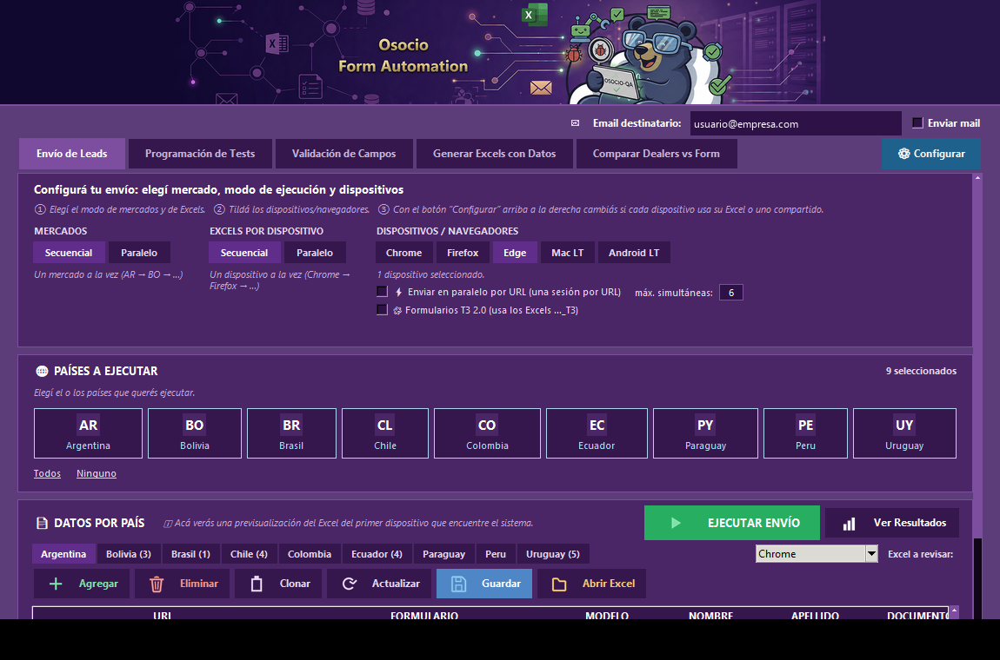
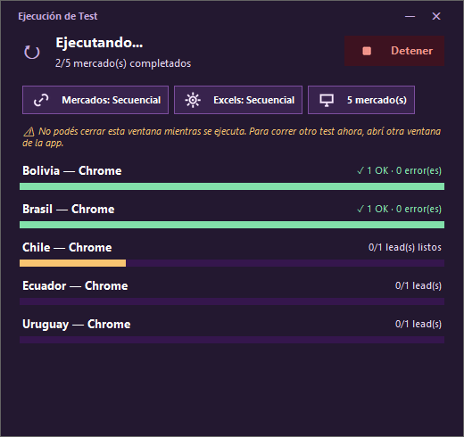
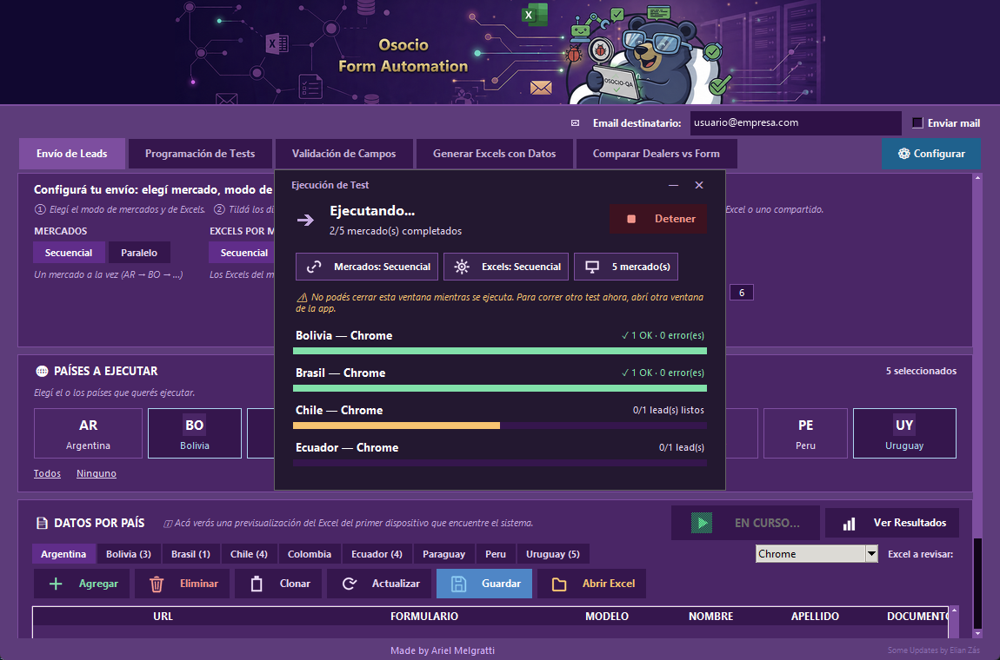
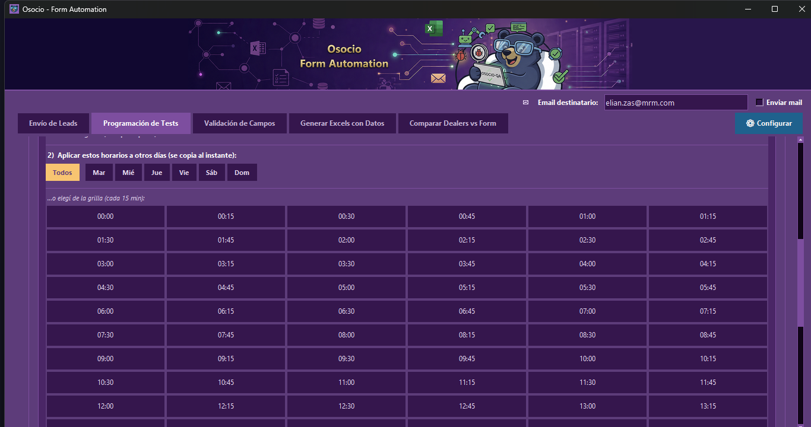
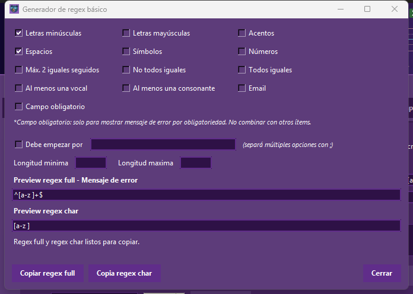
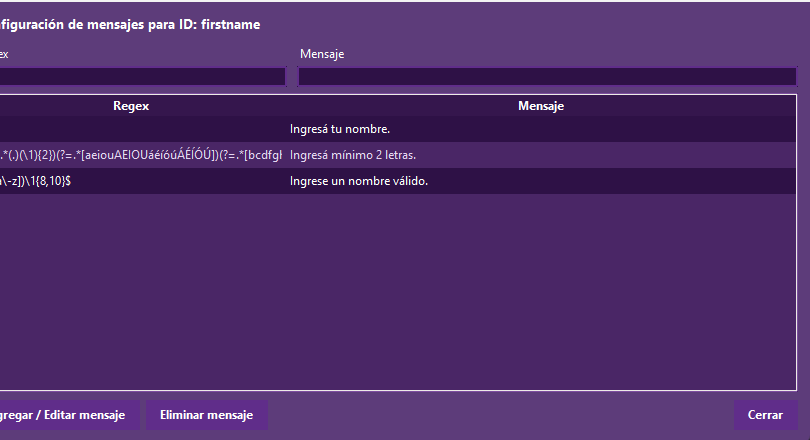
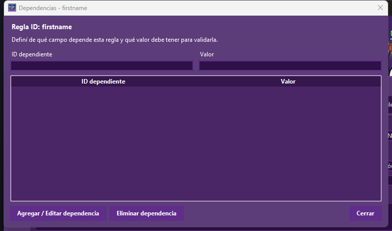

# Osocio — Form Automation

App de escritorio (Windows, Python + Tkinter + Selenium) para automatizar el llenado y envío de formularios de leads en varios países, generar los Excels de datos de prueba, validar reglas de campos, programar ejecuciones recurrentes, y chequear que los concesionarios (dealers) de un formulario coincidan con un Excel de referencia.

> El historial de cambios detallado de versiones anteriores quedó guardado en `README_HISTORIAL_ANTERIOR.md` (no se perdió, solo se sacó de este archivo para dejar una guía limpia).

## Instalación

1. Python 3.10+ (o el que ya tengas en `venv/`).
2. Activar el entorno virtual:
   ```powershell
   .\venv\Scripts\activate
   ```
3. Instalar dependencias:
   ```powershell
   pip install -r requirements.txt
   ```
4. Colocar los drivers de navegador (`chromedriver.exe`, `geckodriver.exe`, `msedgedriver.exe`) dentro de `drivers/` — la app no los descarga automáticamente, solo usa los locales.

## Cómo correr la app

```powershell
python run.py
```

O usá el ejecutable ya compilado: `dist/OsocioFormAutomation.exe` (o la carpeta portable, ver [Build portable](#build-portable)).

Al abrir, vas a ver la barra superior con el logo, el campo de **Email destinatario** y el checkbox **Enviar mail** (configuración compartida por todas las pestañas), debajo las 5 pestañas de la app, y al fondo de la ventana una **consola de log** (ver más abajo). La app recuerda casi toda tu configuración entre una sesión y otra — no hace falta reconfigurar todo cada vez que la abrís (ver "La app recuerda tu configuración" en la pestaña Envío de Leads).

---

## Elementos comunes a toda la ventana

- **Email destinatario / Enviar mail**: si tildás "Enviar mail", al terminar una corrida (Envío de Leads o Programación de Tests) se manda un mail de resumen a esa dirección. Se habilitan además "Adjuntar resultados", "Adjuntar screenshots" y el modo de envío (**1 por país** o **Consolidado**, un solo mail con todo).
- **Minimizar a la bandeja al cerrar** (checkbox dentro de "⚙ Configurar" en Envío de Leads): si está tildado, al apretar la ❌ de la ventana la app no se cierra: se oculta y aparece un ícono en la bandeja del sistema (al lado del reloj de Windows). Doble click en ese ícono reabre la ventana; click derecho muestra "Restaurar" y "Salir". Si **no** está tildado, la ❌ cierra la app directamente (matando cualquier navegador que haya quedado abierto). En cualquiera de los dos casos, **si hay un envío o comparación corriendo**, la ❌ nunca cierra ni manda a la bandeja: solo minimiza la ventana a la barra de tareas, para no cortar un proceso a mitad de camino.

---

## Pestaña: Envío de Leads

Es la pestaña principal: rellena y envía los formularios reales usando los Excels de datos generados.


**Paso a paso:**

1. **Email destinatario** (arriba a la derecha): si querés recibir un resumen por mail, escribí el destinatario y tildá **Enviar mail**. Se habilitan "Adjuntar resultados", "Adjuntar screenshots" y el modo de envío.
2. **⚙ Configurar** (botón destacado a la derecha de las pestañas): abre la configuración avanzada unificada para toda la aplicación. Permite configurar:
   - "Un Excel por dispositivo" o "Un Excel compartido para todos los dispositivos" (con aviso naranja si es compartido).
   - **Ver navegador mientras corre**: determina si el navegador se abre visible u oculto (headless) en segundo plano de manera global (aplica tanto a envíos de leads, programación, como al Comparador de Dealers).
   - **Pausar para login manual antes de llenar el primer formulario**: al activarse, la app abre el navegador en la landing y **frena ahí** con un cartel emergente para que inicies sesión a mano (SSO, MFA, credenciales). Recién cuando apretás 'Aceptar' cierra cookies, saca la captura de la landing, detecta el formulario y arranca el llenado normal; con 'Cancelar' se corta la ejecución. Aplica a envíos manuales, programados y al Comparador de Dealers.
   - **Minimizar a la bandeja al cerrar**: controla la acción de cierre (ocultar en la bandeja del sistema o salir).

   

3. **MERCADOS** y **EXCELS POR DISPOSITIVO**: cada uno se pone en **Secuencial** (uno detrás del otro) o **Paralelo** (todos a la vez), y son independientes entre sí.
   - **MERCADOS** decide cómo se recorren los países: uno por vez (AR → BO → …) o todos juntos.
   - **EXCELS POR DISPOSITIVO** decide, dentro de cada país, cómo se corren los Excels de los dispositivos que tildaste: Chrome → Firefox → Edge uno detrás del otro, o los tres a la vez. El modo Paralelo acá solo aplica a los navegadores locales (Chrome/Firefox/Edge); LambdaTest corre siempre secuencial.
4. **DISPOSITIVOS / NAVEGADORES**: selección múltiple — Chrome, Firefox, Edge, Mac LT, Android LT.
   - **⚡ Enviar en paralelo por URL (una sesión por URL)**: en vez de correr todo el Excel de un dispositivo como una sola sesión de a un lead por vez, abre **una ventana de navegador por cada fila** del Excel, todas al mismo tiempo — mucho más rápido para volúmenes grandes. Solo aplica a los navegadores locales (Chrome/Firefox/Edge); LambdaTest siempre corre como una sola sesión, ignora este modo. El campo **"máx. simultáneas"** (por defecto 6, límite real de 1 a 20) controla cuántas ventanas se abren a la vez para no saturar la PC. Este modo **se desactiva solo** cuando el envío lo dispara la Programación de Tests (ahí siempre corre secuencial, aunque hayas dejado la casilla tildada).
   - **🧩 Formularios T3 2.0 (usa los Excels …_T3)**: tildalo si los formularios de este envío son la versión nueva Adobe AEM — la app busca directamente los Excels con sufijo `_T3.xlsx` en vez de los normales. 
   - Al elegir **Mac LT** o **Android LT** aparece a la derecha el panel **CREDENCIALES LT** con los campos **User** y **Key** (la contraseña se ve enmascarada). Se auto-completa con lo que ya tengas guardado en `lambdatest_credentials.txt`; si lo cambiás y apretás **💾 Guardar**, se sobreescribe ese archivo. Es la única forma de cargar credenciales de LambdaTest desde la app (no hay otra pantalla de configuración para esto).

   

5. **PAÍSES A EJECUTAR**: hacé click en las tarjetas de los mercados que querés correr (AR/BO/BR/CL/CO/EC/PY/PE/UY) — se pueden elegir varios a la vez, cada tarjeta clickeada queda resaltada y el contador de arriba a la derecha suma. Los links **Todos** / **Ninguno** seleccionan o deseleccionan todos de un click. Recién ahí se habilita (se pone verde) el botón **EJECUTAR ENVÍO**; con 0 países elegidos queda gris y sin click.

   

6. **DATOS POR PAÍS**: una tabla de previsualización y edición rápida del Excel que se va a usar. Elegís el país con las solapas (Argentina, Bolivia, …) y, si ese país tiene más de un Excel (por distintos dispositivos), el combo **"Excel a revisar"** de la derecha te deja elegir cuál mirar. Botones sobre la tabla:
   - **+ Agregar**: agrega una fila vacía al final.
   - **🗑 Eliminar**: borra la(s) fila(s) seleccionada(s).
   - **📋 Clonar**: duplica la(s) fila(s) seleccionada(s).
   - **🔄 Actualizar**: descarta cambios sin guardar y vuelve a leer el Excel del disco.
   - **💾 Guardar**: escribe los cambios de la tabla de vuelta al archivo Excel.
   - **📂 Abrir Excel**: abre el archivo con Excel/la app asociada, por si preferís editarlo ahí directamente.
   - Podés editar cualquier celda con **doble click** encima (aparece un cuadro de texto editable in-line).

   

7. **EJECUTAR ENVÍO**: se habilita apenas elegís al menos un país. Antes de arrancar, la app **valida que exista un Excel con al menos un lead** para cada combinación país + dispositivo elegida; si alguno falta o está vacío, no ejecuta nada y te lo dice con el detalle (ej. *"Colombia · Chrome: … (vacío / sin leads)"*). Si está todo bien, abre el **modal de ejecución** (ver abajo).
8. **Ver Resultados**: abre la carpeta `resultados/` con el Excel de resultados y las capturas de pantalla de esa corrida. Para LambdaTest, la app **no muestra el video dentro de la ventana**: el link al video de la sesión queda como una columna **"Video LT"** dentro del Excel de resultados — abrilo desde ahí y hacé click en el link.

> Antes de ejecutar necesitás tener generado el Excel de datos correspondiente — si falta, andá primero a la pestaña **Generar Excels con Datos**.

### El modal de ejecución

Mientras corre el envío, la app abre una ventana "Ejecución de Test" que es tu único tablero de control: te dice qué está pasando y es lo que usás para frenar.



Qué muestra, de arriba abajo:

- **Ejecutando… / N de M mercado(s) completados**: el avance general de la corrida.
- **Detener**: corta todo. No mata el proceso de golpe: le avisa a las sesiones que frenen, así que puede tardar unos segundos en cerrar los navegadores que estén a mitad de un lead.
- **Las tres pastillas** (*Mercados: Secuencial · Excels: Secuencial · N mercado(s)*): un recordatorio de con qué configuración arrancó **esta** corrida. Sirve para no confundirte si después cambiás los selectores de atrás.
- **Una barra por mercado + dispositivo** (`Bolivia — Chrome`, `Brasil — Chrome`, …): cada una avanza sola. A la derecha ves el estado: mientras corre dice cuántos leads van (`0/1 lead(s) listos`) y al terminar cambia al resultado (`✓ 1 OK · 0 error(es)`). La barra queda **verde** cuando el mercado terminó y **naranja** mientras está en curso.

Mientras el modal está abierto, **la ventana de atrás queda bloqueada** (no podés tocar los selectores ni cambiar de pestaña) para que no le muevas la configuración a una corrida en progreso — por eso el aviso amarillo *"No podés cerrar esta ventana mientras se ejecuta. Para correr otro test ahora, abrí otra ventana de la app."* El botón EJECUTAR ENVÍO de atrás también se deshabilita y pasa a decir **"EN CURSO…"**:



**Cuando termina**, el modal no se cierra solo: se le agregan abajo tres cosas y espera a que las leas.

1. Un **banner de email**: verde con *"✉ Email de resultados encolado a: …"* si tenías "Enviar mail" tildado, rojo si lo tildaste pero **te olvidaste del destinatario** (*"Falta el destinatario: no se envió email"*), o gris si el envío de mail estaba apagado.
2. El **resumen final**: `🟢 N OK` / `🔴 N con error`, sumando todos los mercados.
3. El botón **Cerrar resultados**, que es el que libera la ventana de atrás.

**Qué capturas deja cada lead** (en `resultados/screenshots_<País>_<Navegador><N>/`):

1. `landing_inicial_…` — la landing con el formulario inserto. Si está tildada la pausa para login manual, se toma **después** de que aceptás el cartel (así queda con la sesión ya iniciada).
2. `form_errores_…` — la app aprieta primero **Enviar/Siguiente con el formulario vacío** para forzar las validaciones y captura los mensajes de error. En formularios de varios pasos hay una por paso: `form_errores_paso1`, `form_errores_paso2`, …
3. `form_completado_paso1`, `form_completado_paso2`, … — cada paso ya cargado con los datos del Excel, justo antes de pasar al siguiente (solo en formularios multi-paso).
4. `form_completado_…` — el formulario completo con todos los datos, antes de enviar.
5. `landing_typage_…` — la Thank You page.

Las capturas del formulario recortan **solo el área del form** (en varias partes unidas si es más alto que la pantalla), así que no arrastran toda la landing cuando ésta es kilométrica, y los PNG largos se comprimen para que la carpeta de una corrida pese poco (~1-2 MB por lead).

**Chequeo de la Thank You page (columnas "TYP con CTA" y "LINK ISSUE TYP")**

Después de enviar el lead, la app no se queda solo con la captura de la TY page: revisa los links que hay adentro y deja el resultado en dos columnas del Excel de resultados.

- **TYP con CTA**: busca los `<a>` dentro de la TY (`div#thank-you` / `div.rp-wrapper`). Si no hay ninguno queda en `NO`; si hay, los abre uno por uno y anota, por cada link, el texto, el `href`, el `target`, a qué URL terminó llegando y el nombre de la captura que dejó. Si hay varios, van todos separados por ` || ` (`SÍ (2 links) || …`).
- **LINK ISSUE TYP**: detecta links **rotos por HTML mal escapado** — un `href`/`data-href`/`data-url`/`src` cuyo valor trae adentro un tag literal (`</span`, `&lt;`, etc.), típico de una inyección de contenido mal armada. Si aparece, marca `SÍ` con la descripción, una captura señalando dónde está el link, y adónde llevó al clickearlo. Si no hay nada raro, queda en `-`.

Las capturas de este chequeo se guardan aparte, en `cta_evidence/`. En LambdaTest (Mac/Android) el CTA se reporta igual en el Excel, pero **sin** captura de evidencia.

**La app recuerda tu configuración:** todo lo que elegís en esta pestaña (dispositivos tildados, modo Mercados/Excels, "enviar en paralelo por URL" + su máximo, "T3 2.0", y toda la config de email) se guarda solo, apenas lo cambiás, en `json/config_global.json`. Si cerrás la app y la volvés a abrir, la encontrás tal cual la dejaste — no hace falta volver a tildar todo de nuevo.

---

## Pestaña: Programación de Tests

Programa la ejecución automática y recurrente de "Envío de Leads" (por ejemplo, todos los martes a las 03:00) sin que tengas que apretar nada.


**Paso a paso:**

1. **MERCADOS** y **DISPOSITIVOS / NAVEGADORES**: mismos selectores que en "Envío de Leads". Si elegís LambdaTest acá, aparece un aviso: *"Si corrés en paralelo con LambdaTest, asegurate de que tu plan soporte suficientes sesiones concurrentes."*
2. **⚙ Configurar automatización**: abre el calendario semanal.
   - **Días (Lun a Dom)**: hacé click en un día para abrir su panel de horarios (vuelve a hacer click para cerrarlo). Debajo de cada día ves un estado: `—` (nada programado), `N sel.` (N horarios elegidos), o `● abierto` (el que tenés desplegado ahora).
   - **Horarios del día abierto**: una grilla de botones cada 15 minutos (00:00 a 23:45) — click para tildar/destildar un horario, se pone de color y con relieve "apretado" cuando está activo. Podés elegir tantos horarios como quieras en el mismo día.
   - **Agregar horario personalizado**: un campo `HH:MM` + botón **+ Agregar** (o Enter) para un horario que no caiga justo en el grillado de 15 minutos.
   - **Horarios elegidos**: aparecen como chips "✕ HH:MM" debajo de la grilla — click en el chip para sacar ese horario puntual.
   - **Aplicar a otros días**: con al menos un horario tildado en el día abierto, aparece la fila **"Aplicar estos horarios a otros días"** — botón **Todos** (copia instantánea a los 7 días) o elegir días puntuales y confirmar con **"✓ Aplicar a N días"** (si un día ya tenía horarios, se avisa "(se reemplaza)").

     

   - **Modo "Solo este día" / "Todos los días"**: si activás "Todos los días", cualquier horario que toques en el día abierto se replica en vivo a todos los demás días (aparece un aviso "⚠ Cambios aplican a TODOS los días"). Es distinto de "Aplicar a otros días", que es una copia puntual de una sola vez.

   

   - **PAÍSES A TESTEAR**: tildá los países que se van a correr en cada disparo programado (link **"Seleccionar todos"** para marcarlos todos juntos).
   - **Guardar configuración**: guarda el calendario armado. Antes de guardar, la app valida que ya existan los Excel necesarios en `data/` para cada combinación país + dispositivo elegida (si falta alguno, avisa "Archivos Excel Faltantes").
3. Una vez guardada, en la pestaña principal aparece la tarjeta **"Programado en background"** con un resumen del próximo disparo (día, hora, modo, mercados).
4. **Programar test automático**: activa la programación. El botón cambia a **Iniciar ahora** (para disparar ya, sin esperar el horario) + **Desactivar**.
5. **La app tiene que estar abierta** para que el monitor (revisa cada 5 segundos) detecte el horario y dispare la ejecución — si estaba cerrada, al reabrirla corre el horario pendiente del día.

---

## Pestaña: Validación de Campos

Chequea que las reglas de validación (regex, largo, campo obligatorio, etc.) de cada campo del formulario real coincidan con lo esperado — sin llegar a enviar un lead real.


**Paso a paso:**

1. **Tabla de URLs**: se carga desde un Excel (columnas País / URL / Formulario). Usá **Abrir Excel** para editarlo por fuera, o **Actualizar** para recargarlo después de un cambio. **Ver navegador**: tildalo si querés ver el browser mientras corre la validación.
2. **▶ Configuración de ID**: desplegá esta sección para mapear cada campo del formulario. Al abrirla ves:
   - **ID**: el id real del elemento HTML en el formulario.
   - **Descripción**: nombre legible del campo (ej. "NOMBRE").
   - **Dropdown**: tildalo si el campo es un `<select>` (desactiva los campos de regex, que no aplican).
   - **Inputmode = "numeric"**: marca que el campo muestra teclado numérico en mobile.
   - **Regex full** / **Regex char**: la expresión regular completa del valor válido, y la de caracter-por-caracter (para bloquear teclas inválidas mientras se escribe).
   - **Texto de prueba**: el valor que se va a tipear en ese campo durante la validación, más una fila de checkboxes por país (AR/BO/BR/CH/CO/EC/PA/PE/UY) para que la regla aplique solo a algunos mercados.

   

   - **Filtro** (texto libre) + combo de **País** + **Limpiar filtros**: filtran la tabla de reglas de abajo.
   - **Generador regex**: abre un asistente para armar la expresión regular sin escribirla a mano — tildás combinaciones de **Letras minúsculas, Letras mayúsculas, Acentos, Espacios, Símbolos, Números, Máx. 2 iguales seguidos, No todos iguales, Todos iguales, Al menos una vocal, Al menos una consonante, Email, Campo obligatorio**, y definís **Mín./Máx. largo**. Va mostrando en vivo el "Regex full" y "Regex char" resultantes, con botones **Copiar regex full** / **Copia regex char** para pasarlos al portapapeles y pegarlos en los campos de arriba.

     

   - **Limpiar campos**: vacía el formulario de arriba para cargar una regla nueva desde cero.
   - **Mensaje de error**: abre un popup para definir qué mensaje de error espera ver la app cuando el campo falla. Si el campo es Dropdown, es un único mensaje; si no, podés cargar **varias reglas regex → mensaje** (distintos mensajes según qué regla de formato se rompa) — ojo, primero tenés que tener un ID cargado/seleccionado, si no la app avisa "Completá o seleccioná un ID antes de configurar mensajes." en vez de abrir el popup vacío.

     

   - **Dependencia**: abre un popup para decir que este campo depende del valor de otro (ej. "Ciudad" solo tiene sentido si "Región" ya tiene un valor elegido) — se arma como una lista de pares (ID dependiente, Valor), con botones **Agregar / Editar dependencia** y **Eliminar dependencia**.

     
   - **Agregar regla / Editar regla**: guarda el formulario de arriba como una regla nueva, o actualiza la seleccionada (el botón cambia de nombre solo según si hay una fila elegida en la tabla).
   - **Eliminar regla**: borra la regla seleccionada de la tabla.
   - **Tabla de reglas**: lista todo lo cargado (ID, Dropdown, Descripción, Dependencias, Regex full, Regex char, Texto de prueba, Países, Teclado mobile) — click en una fila para traerla al formulario de edición.
3. **Ejecutar validación**: corre la validación real contra el/los formularios configurados.
4. **Resultados**: abre la carpeta con el detalle de la validación.

---

## Pestaña: Generar Excels con Datos

Genera el Excel de datos de prueba (nombre, documento, teléfono, email, modelo, ciudad, dealer, etc.) que después usan "Envío de Leads" y "Programación de Tests".


**Paso a paso:**

1. **MERCADO A GENERAR**: elegís un país a la vez (se genera un Excel por mercado).
2. **DISPOSITIVOS PARA EL EXCEL**: selección múltiple (Chrome, Firefox, Edge, Mac LT, Android LT) — se genera un Excel por dispositivo elegido. Tildá **"Es formulario T3 2.0"** si el form es la versión nueva Adobe AEM (el archivo se genera con sufijo `_T3.xlsx`).
3. **URLS A PROCESAR**: elegí el formato con las pills — **"URL Landing + URL Form"** (`url landing • url form • ...`) o **"Solo URL Form"** — y pegá las URLs en el cuadro de texto.
4. Botones de la barra inferior:
   - **GENERAR EXCELS**: crea los archivos con datos aleatorios nuevos.
   - **REGENERAR DATOS**: recrea los datos manteniendo las URLs ya cargadas.
   - **Borrar URLs**: limpia el cuadro de texto.
5. Los archivos quedan en `data/`, con el patrón `Lead_information_Formulario_<País>_<Dispositivo>.xlsx` (o `_T3.xlsx`).

---

## Pestaña: Comparar Dealers vs Form

Chequea que los concesionarios (dealers) de una marca estén correctamente cargados en un formulario real, comparando contra un Excel de dealers esperados — reemplaza el bookmarklet manual que antes se pegaba en la consola del navegador.


La pestaña está organizada en bloques con una **mini-guía numerada (①→⑤)** en cada uno, todo arriba de la barra de EJECUTAR. Un bloque de 3 columnas (**Navegador · Excel de URLs · Modelos**) y otro de 2 columnas (**Excel de dealers · Columnas del Excel**).

**Paso a paso:**

1. **① MERCADO A CHEQUEAR**: tarjeta del país. Cada país guarda su propia configuración (columnas, Excels, etc.) automáticamente al cambiar de mercado — no hace falta guardar nada a mano para no perder lo que cargaste en ese país.
2. **② NAVEGADOR**: elegí Chrome/Firefox/Edge (las opciones **Mac LT / Android LT** figuran como *próximamente*). La visibilidad del navegador se configura de manera global usando el botón **⚙ Configurar** en el extremo derecho de las pestañas (se aplica a toda la aplicación).
3. **③ EXCEL DE URLs**: en vez de pegar URLs a mano, cargás un Excel (el mismo tipo que usa "Envío de Leads") con columnas **`URL`** (landing) y **`Formulario`** (form). Podés reemplazar un archivo seleccionando otro directamente desde este botón. Muestra un aviso en vivo con la cantidad de forms detectados, o si las URLs parecen de otro país que el mercado elegido.
4. **④ EXCEL DE DEALERS A CHEQUEAR**: botón **"Seleccionar Excel"** (cualquier .xlsx/.xls), **"Fila encabezados"** (número de fila donde arrancan los títulos — el Excel real no siempre arranca en la fila 1), y el toggle **"Tiene columna de filtro"** / **"No tiene filtro (usar todas las filas)"**. Con filtro activo definís **Columna filtro**, **Valor filtro** y la **Condición**:
   - **Incluir**: los dealers de las filas que matchean el filtro (ej. `POSVENTA = si`) **deben estar** en el form.
   - **Excluir**: los dealers de las filas que matchean (ej. `POSVENTA = no`) **NO deben estar** en el form (se verifica su ausencia: si aparecen, es FAIL).
   - Si el Excel viene **pre-filtrado con filas ocultas**, se procesan igual pero se muestra un **disclaimer** en el log con cuáles estaban ocultas.
   - La búsqueda de **EXTRA / DUPLICADOS** (opciones en el form que no están en el Excel) se realiza de forma **jerárquica en conjunto**, adaptándose a los niveles que estén activos. Si tenés habilitados Región, Ciudad y Dealer:
     1. **Región**: Chequea si hay regiones extra en el formulario no declaradas en el Excel.
     2. **Ciudad (en conjunto)**: Selecciona cada región válida del Excel y valida que las ciudades mostradas en el formulario pertenezcan a esa región según el Excel (detecta si una ciudad está cargada bajo una región incorrecta).
     3. **Dealer (en conjunto)**: Selecciona cada combinación válida de `(Región, Ciudad)` del Excel y valida que los dealers correspondan a esa combinación (evita falsos extras por nombres de dealers duplicados entre distintas ciudades).
     Si desactivás un nivel (ej. `dealer`), la app se adapta y realiza la validación jerárquica hasta el nivel más bajo activo (ej. buscando ciudades extras en conjunto con su región).
5. **⑤ COLUMNAS DEL EXCEL**: pills **region / city / dealer** (los ids reales de los selects del HTML del formulario, ej. `region` / `city` / `dealer`). 
   - El nivel `dealer` ya no es obligatorio: podés desmarcarlo para realizar la validación de solo región y ciudad. Definís qué columna de tu Excel corresponde a cada nivel activo.
   - Podés configurar **columnas adicionales a comprobar** (ej. "CEP" → id `customer-cep`). Al agregarlas y escribir el ID en el form, **estas columnas se añaden automáticamente como píldoras-checkbox** junto a `region`/`city`/`dealer`. Podés activarlas o desactivarlas de forma interactiva antes de correr la prueba.
   - Todas estas píldoras y sus estados (habilitada/deshabilitada) se guardan y cargan de forma persistente con tus configuraciones del país.
6. **Modelos** (opcional, 3ra columna del primer bloque): tildá **"Tiene selector de Modelo"** si aplica — **solo funciona con formularios T1** (el id estándar `models`); T2/T3 con selector distinto todavía no están soportados. Elegís **"Todos los modelos"** o **"Modelo(s) específico(s)"** (separados por coma). Cuando hay modelo, **primero se selecciona el modelo y después se revisan los dealers** (la lista de dealers puede depender del modelo).
7. **Modo de salida**: "Solo Excel" o "Excel + Capturas (ZIP)".
8. **Configuraciones guardadas**: guardá el mapeo completo con un nombre (ej. "GMUY Livianos") con **💾 Guardar**, recuperalo con **📂 Cargar** o borralo con **🗑 Eliminar**.
9. **EJECUTAR**: se habilita cuando tenés cargados el Excel de URLs, el Excel de dealers, y mapeadas las columnas de los niveles activos.
   - Durante la corrida, el botón principal se deshabilita mostrando `" EJECUCIÓN EN CURSO"`. El botón de parar queda centralizado de forma segura en el modal de progreso.
   - **Flujo en 2 Fases**:
     - **Fase 1 (Comparación Rápida):** Compara los dealers y campos de inmediato sin tomar capturas. Al finalizar esta fase, **genera y guarda el Excel de resultados en el disco** de inmediato, permitiéndote abrirlo y revisarlo sin demoras.
     - **Fase 2 (Generación de Capturas):** Si seleccionaste la opción de capturas, la aplicación realiza una segunda pasada rápida para capturar cada pantalla y empaquetar el archivo ZIP de resultados.
10. Los reportes (Excel con colores por estado, y el ZIP de capturas si corresponde) quedan en `Dealerscheck_resultados/`.

---

## Estructura de carpetas

- `core/`: lógica base de automatización y formularios por país, incluido `dealer_comparator_runner.py`.
- `forms/`: scripts de entrada para ejecutar los formularios de cada país.
- `interface/`: UI de administración (una pestaña por archivo) y utilidades de soporte.
- `lambdatest_mac/` y `lambdatest_android/`: runners y controllers específicos para correr los formularios sobre LambdaTest (Mac y Android).
- `data/`: archivos Excel de entrada (datos de prueba por país/dispositivo). **No se versionan**: los generás vos desde la pestaña "Generar Excels con Datos".
- `drivers/`: drivers locales del navegador (`chromedriver.exe`, `geckodriver.exe`, `msedgedriver.exe`).
- `resultados/`: resultados y capturas de "Envío de Leads" / LambdaTest.
- `cta_evidence/`: capturas del chequeo de CTA / links rotos de la Thank You page.
- `Dealerscheck_resultados/`: reportes y capturas del Comparador Dealers.
- `json/`: configuración persistente (email, programación, reglas de validación, presets del Comparador Dealers).
- `utils/`: generación de datos de prueba, llenado AEM (T3), chequeo de CTA, programación y rutas.
- `validation/`: motor de la pestaña Validación de Campos (regex, mensajes de error, export).

## Qué hay adentro de `json/` (no la borres)

Es la memoria de la app: sin esta carpeta, la app abre pero **no sabe cómo llenar los formularios**. Se divide en dos grupos.

**1. Conocimiento de los formularios — la app no funciona sin esto.** Viaja dentro del portable y del ZIP, y es lo que hace que el `.exe` sirva apenas lo abrís:

| Archivo | Para qué sirve |
|---|---|
| `field_validation_rules.json` + `field_validation_rules_<país>.json` | Las reglas de la pestaña **Validación de Campos** (regex, largos, mensajes de error esperados, dependencias). Una por país, más la general. |
| `ids_dinamicos.json` | Campos que hay que llenar con un valor fijo tuyo y no con un dato aleatorio (ej. "Número de contrato" = `324` en Argentina). |
| `fixed_field_mappings.json` | Mapeos fijos de campo → valor, para formularios que necesitan siempre lo mismo. |
| `nuevos_campos_<país>.json` | Campos extra que aparecieron en el form de ese país y no estaban en la configuración base. |

**2. Tu configuración personal — se regenera sola.** Si borrás alguno, la app lo vuelve a crear vacío la próxima vez. **Ninguno de estos entra en el portable**, a propósito (así el ZIP que le pasás a otro no se lleva tu email, tu access key ni tus horarios):

| Archivo | Qué guarda |
|---|---|
| `config_global.json` | Email destinatario, **access key de LambdaTest**, dispositivos tildados, y todas tus preferencias de la UI. **Está en `.gitignore`: nunca se sube ni se distribuye.** |
| `programacion_test.json` | El calendario semanal de la pestaña Programación de Tests. |
| `scheduler_triggered.json` | Marca qué horarios ya se dispararon hoy (para no repetir una corrida). |
| `dealer_comparator_settings.json` | Los presets guardados del Comparador de Dealers, por país. |
| `ejecutor_autonomo.log` | Log del modo autónomo (`python run.py --autonomous`). Basura regenerable. |

## Drivers locales (sin descargas automáticas)

La app usa exclusivamente drivers locales desde `drivers/` (junto al proyecto, o junto al `.exe` al compilar). Si el navegador se actualiza y el driver queda desfasado, reemplazá el `.exe` correspondiente ahí adentro.

## Build portable

```powershell
.\build.bat
```

Genera:
- `dist/OsocioFormAutomation.exe`
- `dist/OsocioFormAutomation_portable/` (con `data/`, `drivers/`, `json/`, `resultados/`, `temporales/`, `Dealerscheck_resultados/`, `resultados_lambdatestmac/` y `resultados_lambdatest_android/`)
- `dist/OsocioFormAutomation_portable.zip`

`lambdatest_mac/` y `lambdatest_android/` van empaquetados **dentro** del `.exe` (vía PyInstaller), no como carpetas sueltas al lado — no hace falta copiarlos a mano.

El portable arranca siempre limpio: sin schedule activo, sin configuración personal del Comparador Dealers, y sin `config_global.json` (evita llevarse el email o la access key de LambdaTest de la PC donde se compiló). Los drivers deben seguir distribuyéndose manualmente dentro de `drivers/`.

## Seguridad — credenciales

- `lambdatest_credentials.txt` y `json/config_global.json` (contiene el email y la access key de LambdaTest) están en `.gitignore` — nunca se suben al repositorio.
- El build portable tampoco los incluye (ver arriba).
- Si necesitás correr LambdaTest, creá `lambdatest_credentials.txt` en la raíz del proyecto con:
  ```
  username=TU_USUARIO
  access_key=TU_ACCESS_KEY
  ```
  o cargalas directo desde la app (panel **CREDENCIALES LT** en la pestaña Envío de Leads, ver arriba).
